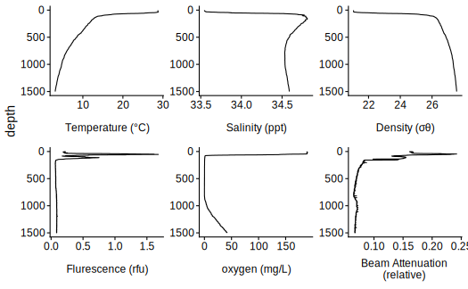
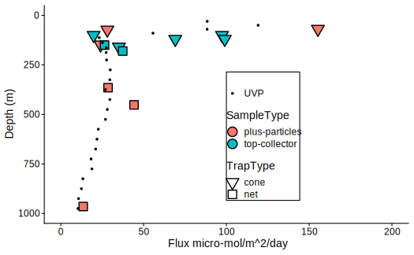

# Abstract

Models and observations suggest that that particle flux attenuation is lower across the mesopelagic zone of anoxic environments compared to oxic ones. This attenuation is likely a function of microbial metabolism, as well as agregation and disaggregation by zooplankton. Analysis of particle size spectra provide insight into the relative roles of aggregation, disaggregation and remineralization.

We measured particle size profiles at a station in the core of the Eastern Tropical North Pacific Oxygen Minimum Zone (ETNP OMZ) using an underwater vision profiler (UVP) multiple times of day, at different times of day, over the course of a week. We normalized our UVP measurements by comparing them to particle flux measurements measured by sediment traps, and we compared our observations to UVP measurements from similar latitudes but with higher oxygen concentrations.

Particle flux attenuated more slowly in the ETNP OMZ than in a similar latitude oxic environment transect. Indeed, flux appeared to increase not only in the photic zone, but at several depth intervals within the anoxic zone, as well as at the base of the OMZ. 

By comparing observed particle size distributions to those predicted by models in which particles remineralized, but did not aggregate or disaggreagate, we were able to quantify net rates of disaggreagation and how they varied throughout the water column. We found that particles appeared to disaggregate above and below the oxygen minimum zone, but not in the core of the OMZ.

These patterns suggest that the oxygen minimum zone affects, but does not eliminate the role of zooplankton in transporting organic carbon to depth, and breaking large particles into smaller particles due to sloppy feeding.

# Introduction
## And:
* Some steinberg model of the role of zooplankton in flux.
* Likely different in OMZ

* Flux attenuates less in oxygen minum zones (Cram) and models have suggested a role of suppressed remineralization
In the ETNP OMZ decreased flux attenuation has been observed near the coast, but not in the open ocean.

Stuff that is known about zooplankton particle interactions.

Stuff that is known about particle size distributions (esp, Guidi and Kiko)

## But
It is not known how migratory zooplankton affect particle size distributions, and if they lead to diel variability in particle flux that might affect overall transport into the deep ocean.
It is not fully known how oxygen limitation affects particle size dynamics and flux.

## Therefore

We conducted the first ever time-series analysis of particles, in an oxygne minimum zone. With the goal of normalizing to observed flux, and comparing particle size data to acoustic data about the distributions of zooplankton and larger orgasnisms. 

# Methods
All measurments were taken on board the R/V Sekuliaq from XX January 2017 thorugh XX January 2017 at XXX Lat XXX Long.

## Water property measurment
We measured water properties of temperature, salinity, fluorescence, oxygen concentration and turbidity using a XXX CTD {get sensor information}. Data were processed using seabird software and analyzed and visualized in R.

## Particle size measurments
Particle size data were collected by underwater vision profiler (UVP) that was mounted to the CTD and deployed for all CTD casts shallower than 2500m. A UVP is a combenation camera and light source that describes the abundance and size of particles from 100 microns to several centemeters in size (ref). Particles have been previously shown to be primarely "marine snow" but may also include a small number of zooplankton and visual artifacts. UVP data were processed using custom matlab scripts, uploaded to XXX, and analyzed in R.

## Flux measurments
Particles were collected in incubating particle traps (REF). Traps were used to performincubation studies which will be reported elsewhere. As part of these studies, the traps also generated data about carbon flux, which is reportd here. Two types of traps were deployed.  The particles were collected in two kinds of traps. One set of traps, generally deployed in shallower water had a solid cone opening with a X m diameter cone opening. The second set had larger conical Xm diameter 200 micron nylon mesh net at the top. In all cases particles collected in the net or cone fell into one of two chambers. The "plus-particles" chamber collected particles from the net and incubated them for an amount of time that ranged from X days to X days. The top-collector trap collected particles, and then returned immediately to the surface. We prferentially used data from the "top-collector"; however in many cases, data was only available forom the "plus-particles" trap, in which case we used that data.

{What if I move the analysis to the results section}
## Analysis

The total number of particles in each size were visualized. We calcualted total particle number by multiplying over all size bins.

### Particle size distribution

 We determined the slope and intercept of the particle size distribution spectrum by fitting a power law of form $log(# Particles) = Int + PSD * log(Size)$. Because large particles were infrequently detected we used a poisson- general linear model that considered the volume of paricles sampled and that assumed that the residuals of the data followed a poisson (rather than normal) distribution.
 
### Estimating particle flux

We estemated particle flux by assuming that particle flux in each size bin followed the equation `flux = C_f * d ^ a` (guidi 2008 ref). We used Alledredge and XXX's estemate of `a` and then fit the observed flux measurments to particle measurments to estemate C_f. We then used this equation to estimate flux from the data collected by the UVP.

### Size specific information

We seperately analyzed total particle numbers, particle size distribution, and particle flux for particles larger than 53 microns, and those smaller than 53 microns to determine the relative contributions of these two particle classes to particle properties

## Variability
We quantified whether the sample to sample variability 

## Model Formuation

# Results

## Chemical Data
Temperature, salinity, density, fluorescence, oxygen and turbidity were examined (Figure 2). The oxygen minimum zone extends from the base of the primary chlorophyl maximum layer (XXXm) to 950m. This site, like many in the ETNP OMZ has two fluorescence maxima, one above, and one inside of the OMZ. Turbidity is highest above the omz, and decreases with depth, and then increases again at the base of the oxygen minimum zone.

## Acoustic data
EK60 data, figure 8. show a peak of migratory plankton which travel from the surface at dawn to a maximum depth of XXXm and then return to the surface at dusk. 

* Similar patterns between different freuencies, with better resoultion by the lower bandwidth. While we expect that small organisms likely have the greatist impact on particles, 

## Flux data
Flux measurmenets at station P2 were consistant between the different particle trap types and chambers measured, and showed a profile that broadly represented a power law with respect to depth, with the exception that flux appeared to increase around 500m.

## Particle abundance measurments 
Particles at all depths are most abundant in the smallest size fraction and less abundant in larger size fractions. At every depth, partiles roughly followed a power law with respect to size. Thus, a particle size distribution slope could be calculated at each depth and compared. {This is what the PSD slope does}. 

These patterns differed from those seen at the P16 transect, station 100 where XXXXX. 

## Estemated particle flux
When fit to the flux profile data (per Guidi et al.) we predicted that the particle flux to size ratio was best goverend by the relationship flux = cXX * size ^ aXX. As the exponent parameter in this best fit was much smaller than predicted values, we also performed a fit where that value was taken from the literature and set to aXX1. In this case the relationship was governed by the equation flux = 10.51 * size ^ axx1. This resulted in a flux profile that broadly fit the results seen by the traps (figure XX).  

### Large vs small particles

Generally the profiles are related. Most flux appears to be from smaller particles.

## Possible particle transport by zooplankton
There was an apparent increase in particle flux between XXX and XXX m (Figure X), which corresponded to the region where migratory organsisms spent most of the day (Figure X). 
To estemate how this flux increased transfer efficiency, we compared the sequestration flux (flux through the depth bin centered at 975m) to an estemated sequestration flux if a power law, typical of the flux attenuation below 500m, was applied to the flux out of the photic zone (185.5m bin). 

Extrapolating the power law relationship seen below 500m to the flux at the base of the photic zone suggests that if it was not for zooplnkton transport the transfer efficiency would be 1/3 of what it is observed to be.

{Compare to P2.}

## Variations from remineralization and sinking dynamics

By comparing the particle size distributions at each depth to the particle size distribution that woudl be predicted from the particle size distribution one depth bin shallower in the water column, and the observed flux attenuation, we were able to examine how particle number attenuation differed from what would be expected if particles sank and remineralized following PRiSM model like dynamics. We observed that there were more small particles than would be predicted from remineralization dynamics only. By comparing the observed flux of particles < 53 microns to the reminineralization-predicted flux of small particles, we observed that above 500m, there was excess observed small particle flux above 500m (Figure X). 

{Discussion: This suggested that one of two things could be happening. The first is that particle disaggregation, possibly caused by sloppy feeding by zooplankton, could be breaking large particles into smaller particles. The other possibility is that zooplankton could be preferentially removing larger particles via grazing, leaving smaller particles behind}. 

##

# Figures

Figure 1. Map of the ETNP Oxygen Minimum Zone and the location of station P2. Colors indicate chlorophyll concentrations at the surface, while the red ouline signifies the region containing low oxyegen.

Figure 2. Mean oceanographic parameters at ETNP station P2 **(A)** temperature **(B)** Salinity, **(C)** Chlophyll Concentrations **(D)** Oxygen concentrations **(E)** Turbidity

Figure 3. A profile of data generated by the UVP. At each depth the abundance of particles at each size are color coded on a log scale. Particle sizes where no particles in that sample were seen are represented with a smaller black dot.

Figure 4. Summary statistics of particle distributions. (A) Total particle numbers, (B) Particle size distribution. Color indicates the time point at which the sample were collected. As we did not detect appreciable differences between the stations, we report the color map for which points connect to which stations in the supplement.

Figure 5. Particle flux, measured from sinking traps large symbols. Data from the "plus particles" and "top collector" samples from both cone and net traps were collated to generate these data. Trap types are shown by the shape and color of the large points. Superimposed are binned estemates of particle flux generated by fitting the particle size distribution to the trap counts.

Figure 6. Binned particle number, slope, and flux for large ($>= 0.53\, \mu m$) and small ($< 0.53 \, \mu m$) particles.

Figure 7. **A** Flux profile from smoothed particle size distributions. Regions where flux is *increasing* are coded as {color}. **B** Particle disaggregation, measured by comparing the expectation of a model in which there is no disaggregation to one in which there is disaggregation. It is the descrepancy between the observed and model predicted flux of small particles, devided by the attenuation of large particles. In other words it is the fraction of the decrease in large particle flux that appears as small particle flux.

Figure 8. Acoustic data, measured by EK60, measured over the course of the experiment. Particle flux increases, and particle disaggregation both appear to associate with the top 500 m where organisms of all sizes are sometimes present.

Figure S1. Observed particle size distribution superimposed and the gam fitted particle mean and bootstrapped 95% prediction intervals of those size distributions. That statisticaclly siginificantly more points fall outside of the prediction intervals than by chance alone suggests that there is more variability between points than predicted by random sampling effects alone.

Figure S2. Particle numbers and flux at P16 station 100 (Lat XXX, Lon XXX)

Figure S2. Smoothed particle size distribution data used to inform the disaggregaton model.

# References

