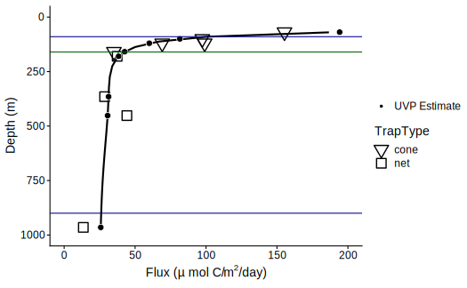
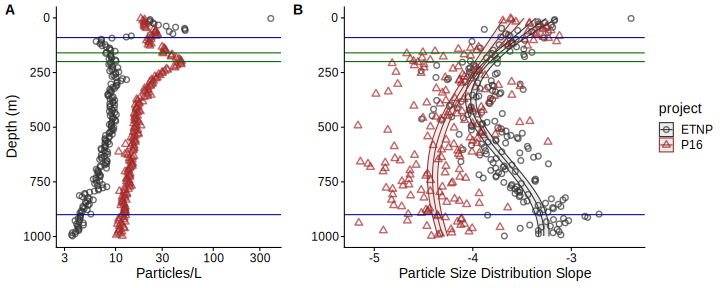
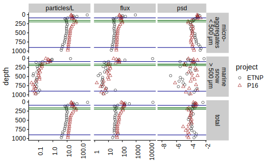

# Title:

# Author list (putative, order not set)
Jacob Cram
Jessica Pretty
Megan Duffy
Rachael L
Clara Fuchsman
Klaus H
Thomas Weber
Shirley Leung
Jaqui N
Allan Duvol
Rick Keil
Andrew McDonnel

# Abstract

Models and observations suggest that that particle flux attenuation is lower across the mesopelagic zone of anoxic environments compared to oxic ones. This attenuation is likely a function of microbial metabolism, as well as agregation and disaggregation by zooplankton. Analysis of particle size spectra provide insight into the relative roles of aggregation, disaggregation and remineralization.

We measured particle size profiles at a station in the core of the Eastern Tropical North Pacific Oxygen Minimum Zone (ETNP OMZ) using an underwater vision profiler (UVP) multiple times of day, at different times of day, over the course of a week. We normalized our UVP measurements by comparing them to particle flux measurements measured by sediment traps. We also explored how our measurements related to acoustic observations of migratory marine species. We also compared our observations to UVP measurements from a site at a similar latitudes but with non limiting oxygen concentrations.

Particle numbers and size distributions showed a non monotocinc trend, with sharp decreases in particle numbers the photic zone and the lower 500m of the OMZ, but increases in the top 350 m of the OMZ and below the OMZ. These increases in particle number generally concurred with increases in the particle size distribution slope suggesting that the increase in particle numbers were due to a production of small particles.

Particle flux at our site was characterized by rapid attenuation in the top layer of the OMZ followed by either low attenuation or a small increase in abundance, depending on the day of the study, around 500m. This region coresponded with the presence of migratory plankton that spent the day in this region.

A model of particle remineralization and shrinking was used to diagnose whether particle size patterns violated the assumption that particles only sink and remineralize, and are neither aggregated, disaggregated, or tranported by zooplnkton. Our model identified aggregation like processes between 250 and 500m of in the water column that occurred at all time-points.

Our data suggest a role of zooplantkon in transporting biomass in the form of fecal pellets, into the core of the OMZ, but also in disaggregating particles in this same region. We further observe that there is temporal varibility in flux transport, but that this variability is small, only accounting for ~X % of the variability in flux, and not accounting for variability in particle numbers or size distribution over the one week time period studied.

# Introduction
## And:

### The biological pump is important and modulated by stuff, including zooplankton
* Sinking particles are the main way that carbon gets transported into the ocean, and the processes that regulate this biological pump regulate global atmospharic carbon levels (Kwon).

This process is known as the biological pump (ref)

* Several factors modulate this flux and include:
Particle size, 
the dependence of particle degrading microorganisms on temperature and oxygen concentrations,
the dependence of particle sinking speed on water viscocity and temperature,
faster particle sinking due to ballasting by heavy materials such as carbonate and silicate,
particle compositoin affecting breadown rates -- for instance carbonate has been suggested to protect surrounding POM from degredation by bacteria
alternatively particles in some region, or some kinds of particles may be more resistant to microbial degredation due to differences in POM content
particle shape and porosity may also affect breakdown and sinking

* Zooplankton modulate organic mater flux this flux by repackaging particles (steinberg and refs therein), feeding at the surface and excreeting at depth (bianchi 2013 and others), thereby facilitating flux of carbon, and dying at depth (Steinberg and refs therein).
* Zooplankton can further modulate flux by altering the particle size distribution. They can consume particles of a rane of sizes and repackage them into more uniform, perhaps faster sinking fecal pellets. Conversely, through sloppy feeding they can break large particles into multiple, slower sinking, smaller particles. {merge with point above}

* Oxygen minimum zones are expanding (ref) and have been postulated to play a role in changing biogeochemical cycles.

They have unique effects on zooplankton because they limit the ability of anoxia sensitive zooplankton to migrate (ref) and also limit the ability of some anoxia sensitive predators. The limiting oxygen enviornment may also impact the behavior of zooplankton that are there as they avoid oxygen requiring behavior such as feeding. 
Community structure is distinct in the OMZ  and characterized by XXX (Maas). 

### Our site
The ETNP is the biggist baddist OMZ (ref). While many OMZ, especially coastal ones, are characterized by high productivity which leads to carbon flux which removes oxygen from mid water depths (ref), the bulk of the ETNP OMZ is characterized by low productivity , with the low oxygen caused by slow ocean circulation through the OMZ region (refs clara sent). Many previous charicterizations of flux at this site, happened in coastal regions (that paper I used in my talks). Flux has not been previously characterized in this region (unless meg gets her paper out first). 
The site is characterized by nitrogen loss processes by both anammox and cannonical dentitrification processes. (Fuchsman cyano paper, probably many others). 

### Predicitons

#### Bianchi weber
* Models suggest that organic mater flux into the deep ocean is *more* efficient in oxygen minimum zones (Cram, Deveries and Weber).
** Bianchi and Weber proposed three reasons that this could occur
(1) Slower attenuation of *all* particles: The rate of remineralizatoin of all particles could be slower in OMZs.
(2) Decreased disaggregation by zooplankton: 
(3) Slower attenuation of large particles: Large particles might harbor cores that are limited in both oxygen and nitrate and so microbial metabolism could be unually slow in these.

The authors proposed that these processes would have signature effects on particle size distribution in the core of the ETNP. Slower attenuation of all particles, was predicted to result in an increase in the abundance of small particles, while the other two models, would result in a decrease in small particle abundance as small particles were either not replaced by breakdown of large particles (model 2) or as those particles were broken down more quickly than larger particles (model 3). *but* they didn't have data to determine which model was bestist.

#### Kiko
Zooplankton transport has also been postulated to be effected by zooplankton.
Kiko et al. explored zooplankotn distributions and particle size distributions in the eastern tropical north atlantic, which has a weak oxygen minimum zone. They found transport into the omz core by zooplankton. They postuated, that this was possible becaues there was still oxygen. *but* similar analysis of particle size distributions and estemates of flux haven't been done in the OMZ core. (kiko). 

### Methods

Underwater vision profilers have provided important insights into particle size distributions in the ocean.
Flux profiles measured by traps can be compared to UVP measurments to estimate the size to mass and sinking speeed relationships of particles (ref).
They can show useful things about spatial (guidi, kiko A) and temporal (kikoA and B) variability in the ocean. Indeed these data were critical in constraining a model (cram).

Traps tell us a lot about flux.

Acoustic data can tell us a lot about nekton distributions, and even those of plankton.

The meausurements have synergistic effects, as demonstrated by Kiko et al in the ETNA (damn them). 

<!-- #### Graveyard susection -->

<!-- Oxygen minimum zones have different flux patterns than other oceans because low oxygen affects microbial resperation of particles, and the behavior of migratory plankton that require oxygen, and whose predators require oxygen. Thus low oxygen could inhibit zooplankton from spending time at anoxic depths, or encorage it, if it provides protection of larger more metabolically demanding predators. -->

<!-- * Flux attenuates less in oxygen minum zones (Cram) and models have suggested a role of suppressed remineralization -->
<!-- In the ETNP OMZ decreased flux attenuation has been observed near the coast, but not in the open ocean. -->

<!-- Stuff that is known about zooplankton particle interactions. -->

<!-- Stuff that is known about particle size distributions (esp, Guidi and Kiko) -->

<!-- Particle size distributions can be compared to flux by normalizing to trap data (Guidi). -->

<!-- In the ETNA, there is a weaker OMZ and particles were compared to acoustic profiles of organims. {Findings} (Kiko 2). -->

## But
* Weber and bianchi's model hasn't been validated against real data.
* Particle size has not been normalized to observed flux in this region.

* The temporal dynamics at diel time scales have not been examined in the ETNP, or any other truly anoxic open ocean region. They have also never before been related to diel migration patterns.

* It is not known how migratory zooplankton affect particle size distributions -- either by tranport of particles, nor by disaggregaton processes.

* It is not fully known how oxygen limitation affects particle size dynamics and flux.

* Acoustic data, traps, and UVP measurments have not been combined in this region.

## Therefore

We conducted the first ever time-series analysis of particles, in the oligotrophic region of the ETNP oxygen minimum zone. With the goal of normalizing to observed flux, and comparing particle size data to acoustic data about the distributions of zooplankton and larger orgasnisms. 

* We compare this data to acoustic signature of diel migrators, of mulitple size classes

* We modified the a particle remineralization and sinking model (PRiSM) (Devries, Cram) to estemate particle size distribution changes that would occur under dynamics where particles only sink and remineralize, and compared observed distributions to ones expeced by the model. This allowed us to quantify the magnitude of non-PRiSM like processes.

* We compared our results to those seen at a station at similar latitude in a non limiting region of the tropical north pacific.

## Scientific questions:
 * How do the particle size distribution at one location in the oligotrophic Eastern Tropical North Pacific evolve with respect to depth, and how does it vary over time?
 * Do our data support any of the Bianchi-Weber models?
 * Do our data suggest regions of the oxygen minimum zone with disaggregtion like processes, and if so do these co-occur with regions suggested to harbor zooplankton.

## We hypothesized
 * Temporal day to day variability in paticle number, particles size distribution slope and flux would be evident.
 * This variability would relate to the location of migratory zooplankton, with a combenation of increased particle flux and disaggregation present where zooplankton occur.
 * Disaggregation and particle production by zooplankton might lead to particle size patterns that cannot be explained by remineralization and sinking alone.
 * All three of the Weber Bianchi hypotheses.
 

# Methods
Most measurments were taken on board the R/V Sekuliaq from 07 January 2017 thorugh 13 January 2017 at XXX Lat XXX Long. Data are compared against {describe station 100 here}

## Water property measurment
We measured water properties of temperature, salinity, fluorescence, oxygen concentration and turbidity using the shipboard XXX CTD {get sensor information}. Data were processed using seabird software and analyzed and visualized in R.

## Particle size measurments
Particle size data were collected by underwater vision profiler (UVP) that was mounted below the CTD-rosette and deployed for all CTD casts shallower than 2500m. A UVP is a combenation camera and light source that describes the abundance and size of particles from 100 microns to several centemeters in size (ref). Particles have been previously shown to be primarely "marine snow" but may also include a small number of zooplankton and visual artifacts. UVP data were processed using custom matlab scripts, uploaded to XXX, and analyzed in R.

## Flux measurments
Particles were collected in incubating particle traps (REF). Traps were used to performincubation studies which will be reported elsewhere. As part of these studies, the traps also generated data about carbon flux, which is reportd here. Two types of traps were deployed.  The particles were collected in two kinds of traps. One set of traps, generally deployed in shallower water had a solid cone opening with a X m diameter cone opening. The second set had larger conical Xm diameter 200 micron nylon mesh net at the top. In all cases particles collected in the net or cone fell into one of two chambers. The "plus-particles" chamber collected particles from the net and incubated them for an amount of time that ranged from X days to X days. The top-collector trap collected particles, and then returned immediately to the surface. We prferentially used data from the "top-collector"; however in many cases, data was only available forom the "plus-particles" trap, in which case we used that data.

{What if I move the analysis to the results section}
## Analysis

The total number of particles in each size were visualized. We calcualted total particle number by multiplying over all size bins.

### Particle size distribution

 We determined the slope and intercept of the particle size distribution spectrum by fitting a power law of form $log(# Particles) = Int + PSD * log(Size)$. Because large particles were infrequently detected we used a poisson- general linear model that considered the volume of paricles sampled and that assumed that the residuals of the data followed a poisson (rather than normal) distribution.
 
### Estimating particle flux

We estemated particle flux by assuming that particle flux in each size bin followed the equation `flux = C_f * d ^ a` (guidi 2008 ref). We used Alledredge and XXX's estemate of `a` and then fit the observed flux measurments to particle measurments to estemate C_f. We then used this equation to estimate flux from the data collected by the UVP.

### Size specific information

We seperately analyzed total particle numbers, particle size distribution, and particle flux for particles larger than 53 microns, and those smaller than 53 microns to determine the relative contributions of these two particle classes to particle properties

## Variability
We quantified whether the sample to sample variability 

## Model Formuation

# Results

## Chemical Data
The anoxic zone, characterized by undetectable oxygen levels extends from 80 m to 850 m depth, with a sharp upper oxycline and a gradual lower oxycline (Figure 1B-D). The upper oxycline tracks a sharp picnocline (Figure 1C 1D), characterized by a abrupt drop in temperature below the mixed layer, and an increase in salinity (Figure 1B).  The site is characterized two fluorescence maxima (Figure 1C). The larger, shallower fluorescence peak is positioned just above the oxycline, ending exactly where oxygen reaches zero. The smaller, lower peak is positioned entirely inside of the anoxic zone. Turbidity tracks the two chlorophill peaks in the surface, and has a tertiary maximum at the lower oxycline (Figure 1D).

## Acoustic data
Acoustic data, generated by EK60 data suggest the presence of multiple cohorts of migratory organisms. Most migratory organisms apppeared to leave the surface at dawn and return at dusk, spending the day between 250 and 500m. There appeared to be two local maxima in backscattering intensity at mid-day, one at ~300m and one at ~375 m. There also appeared to be organisms that migrated downward at dusk and upward at dawn, spending the night at ~300m. Other characteristics included what appeared to be diel migrators that crossed the OMZ and spent the day below the range of the EK60, as well as organisms that appeared between 500m and 1000m but did not appear to migrate to or from that depth at our site, but rather simply trnaseted through the field of the EK60 at that time. There was also a peak of organisms that appeared, at mid-day, on some but not all days, without any visible dawn or dusk migration just above the base of the photic zone.

Similar patterns were evident each other measured frequency, with better resoultion by the lower frequencies (Figure S_). While we expect that small organisms likely have the greatist impact on particles, this overlap between frequencies suggest that the better resolved low frequency signal can inform us about the position of small organisms.

## Flux data
Flux measurmenets at station P2 were consistant between the different particle trap types and chambers measured, and showed a profile that broadly represented a power law with respect to depth, with the exception that flux appeared to increase around 500m. Four traps in the surface had anomalously low measurments of flux, compared to similar traps placed at similar depths, which may have been due to trap malfunctions {Talk to Jaqui about these}.

## Particle abundance measurments
Total particle numbers were generally similar between different casts, regardless of which day or hour they were collected (Figure S_). Particle numbers were highest in the surface and decreased rapidly, flattened out over the 250 m to 500m range, attenuated again untill the lower oxycline, and then increased. Particle numbers were lower at our site, than at the same-latitude, oxygenic P16 station 100.

## Particle size distributions.
Visual examination of the relationship between particle number and size suggested a power law relationship where the log of volume and binsized normalized particle abundance was perportional to the log of the particles size (Figure S_). The exception to this pattern was very large particles, which are rare enough that they are usually not detected by the UVP. A generalized linear model that assumes a negative binomial distribution of the data was able to account for this undersampling of large particles and was able to estemate power log slopes, while taking into account rare occurances of the data (Figure S_). 

The slope of the particle size distribution is a negative number with more small particles than large ones and varied between -4.5 and -3 {PUT IN ACTUAL NUMBERS}, which is typical of other UVP estemates (Ref Guidi, Cram, Kiko) (Figure S_). 
The particle size distribution slope followed a multimodal pattern with respect to depth with X local maxima and X local minima between the surface and 1000m (Figure S_). The particle size distribution slope steepened (became more negative) between the surface and 500m, flattened (became less negative) between 500m and 1000m, and then steepened again after 1000m. Steeper, more negative, slopes indicate more small particles relative to large particles, while flatter, less negative, slopes indicate a higher proportion of large particles relative to other places.

These patterns differed from those seen at the oxic P16-station100, station 100 where particle size distribution was similar to ETNP station P2 through 400m, but wheere the PSD was then consistantly steeper than at P2, and with a local minimum at ~850m and a gradual flattening of the PSD after that.

## Estemated particle flux
Using an optimization algorithm, we found that there was greatist agreement between estemates of trap observed particle flux, and UVP estemated particle flux when the particle size to flux relationship was goverened by the ratio $$Flux = 133 * Size ^ {2.00}$$. This resulted in a UVP predicted flux profile that broadly fit the expected trap observed flux profiles, excluding the four traps that were held out from the analysis due to low abundance.  

Particle flux profiles varied between casts, especially between 100 and 400m (Figure 4a-b). Between X and Xm particle flux appeared to increase on some but not all casts, while attenuating slowly on others (Figure 4c).

### Large vs small particles

Small particles (< 500 um) at our site were about two orders of magnitude more common than large particles (>= 500um). The large particle numbers appeared to attenuate more quickly than small particles, and more genearally follow a power law decrease, rather than the multimodal pattern shown by small and total particles (Figure S_). Flux was predicted to be predominantly from small, rather than large particles. There was one point at the surface where flux appeared to be primarely from large particles, though as particle dynamics are more complex at the surface (Devries REF), we are less confedent about size flux relationships in this region. The particle size distribution, calculated only on large particles, was more variable between depths than calculated for small particles. Data from the oxic P16 station 100 suggested, more particles, steeper particle size distribution, and more flux than at this station, but differences between large and small particles that were similar to those seen at ETNP staion P2. (Figure S_).

<!-- ## Possible particle transport by zooplankton {move to discussion} -->
<!-- There was an apparent increase in particle flux between XXX and XXX m (Figure X), which corresponded to the region where migratory organsisms spent most of the day (Figure X).  -->
<!-- To estemate how this flux increased transfer efficiency, we compared the sequestration flux (flux through the depth bin centered at 975m) to an estemated sequestration flux if a power law, typical of the flux attenuation below 500m, was applied to the flux out of the photic zone (185.5m bin).  -->

<!-- Extrapolating the power law relationship seen below 500m to the flux at the base of the photic zone suggests that if it was not for zooplnkton transport the transfer efficiency would be 1/3 of what it is observed to be. -->

<!-- {Compare to P2.} -->

## Variations from remineralization and sinking dynamics

By comparing the particle size distributions at each depth to the particle size distribution to the distribution that remineralization and sinking model would predict from the flux profile one depth shalower in the water column and observed flux attenuation, we were able to see how observed flux profiles differed from predicted flux profile changes (Figure S_ {generate this for a key depth with both attenuation and disaggregation}). We called the difference between observed and predicted flux of small particles, which is identical, but with opposite sign to the difference between the observed and predicted flux of large particles "Disaggregation Like Flux Shift", because as we will argue in the discussion, disaggregation as well as other processes, would lead to higher values of this Flux-Shift parameter, while aggregation would lead to lower values of the Flux-Shift parameter. We constrain our analysis here to the below photic zone dynamics {for reasons}. There appeared to be highist flux shift between the photic zone and 500m, and negative flux shift below 500m (Figure X). {Say something about P16 once I have identified the location of the photic zone therein.}

<!-- be predicted from the particle size distribution one depth bin shallower in the water column, and the observed flux attenuation, we were able to examine how particle number attenuation differed from what would be expected if particles sank and remineralized following PRiSM model like dynamics. We observed that there were more small particles than would be predicted from remineralization dynamics only. By comparing the observed flux of particles < 53 microns to the reminineralization-predicted flux of small particles, we observed that above 500m, there was excess observed small particle flux above 500m (Figure X).  -->

{Discussion: This suggested that one of two things could be happening. The first is that particle disaggregation, possibly caused by sloppy feeding by zooplankton, could be breaking large particles into smaller particles. The other possibility is that zooplankton could be preferentially removing larger particles via grazing, leaving smaller particles behind}. 

##

# Figures

Figure 1. Overview of the geography, physics and chemistry of ETNP station P2 (A) Map of the ETNP Oxygen Minimum Zone and the location of station P2. Colors indicate chlorophyll concentrations at the surface, while the red ouline signifies the region containing low oxyegen. The red circle indicates the location of Station P2. (B-D) Oceanographic parameters collected from a cast at {DAY-TIME}. All profiles contain a plot of oxygen concentrations. When available, the thin horizontal green line shows the location of the base of the photic zone (160m), while the horizontal blue line shows the base of the oxycline. Figures B and D also show density (Dashed Gray Line). (B) highlights temperature and salinity. (C) fluorescence, focusing on the top 300m of the water column, and (D) beam attenuation.

Figure 2. Acoustic data, measured by EK60, measured over the course of the experiment. Shown are data from the 18000 Hz frequency band, which have highest depth penetration, but which appear to co-occur with data from other frequency bands (see Figure SX). Values are in return signal intensity and have not been normalized to observed biomass.

Figure 3. Particle flux, measured from sinking traps large symbols. Data from the "plus particles" and "top collector" samples from both cone and net traps were collated to generate these data. Trap types are shown by the shape and color of the large points. Superimposed are binned estemates of particle flux generated by fitting the sum of particle numbers all four profiles, binned as in Figure X, to the trap observed flux. The four points enclosed by the rectangle are unusually low compared to other traps collected at the same depth, and were therefore excluded from the fit. 

Figure 4.  Within and between day variability in UVP predicted particle flux at ETNP station P2. Profiles are compared against P16 station 100, a non OMZ station at similar latitude in the tropical pacific. All profiles are depth binned with higher resolution towards the surface (methods).  **(A)** Flux profiles in the top 1000m of the water column. **(B)** A more detailed depiction of the area enclosed by the rectangle in **A**. **(C)** The rate of change of flux, devided by the rate in change in depth. We show the fifth root of these values in order to highlight differences between values close to zero.

Figure 5. **(A)** Gam smoothed binsize and volume particle numbers at each particle size class. **(B)** Particle size distributions. And estimated biomass of **(C)** Small and **(D)** Large particles. {I need to get rid of the green and blue line at P16 -- and maybe calculate the photic zone therein}.

Figure 9. Quantification of non remineralization and sinking like processes. Points indicate the difference between the observed small particle flux, and the flux that would be estimated if particles from the size distribution in the depth bin above remineralized and sank only following the PRiSM model. Values are normalized to the change in depth. Thus values are uMol Carbon/m3/day

# Supplemental Figs
[move to supplement]

Figure 2. An example of observed particle size distribution spectra. These are depth binned data from between X and X m deep in the water column from the cast that occurred at *DATETIME for stn_043*. A total volume of XXX L of water are sampled herein. Points indicate **(A)** total numbers of observed particles and **(B)** particle numbers normalized to volume sampled and particle size bin width. The line indicates the predicted best fit line of the data. The line was fit on the bin and volume normalized data by a negative-binomial general linear model. The line in panel **A** indicates predictions from this same model, rescaled into absolute particle space.

Figure 4. (A) Observed, volume normalized total particle numbers from 9 casts taken at different times of the day at ETNP station P2. (B) Calculated particle size distribution slopes of those particles. These data have not been binnedby depth.

[move to supplement] Figure 5. As above, but for the final cast taken at ETNP station P2 and the only cast collected from the P16 transect at the station 100. P16 Station 100 was chosen because it is at a similar latitude to ETNP station P2. (A) Total particle numbers, (B) Particle size distribution.

Figure 6. Particle flux, measured from sinking traps large symbols. Data from the "plus particles" and "top collector" samples from both cone and net traps were collated to generate these data. Trap types are shown by the shape and color of the large points. Superimposed are binned estemates of particle flux generated by fitting the sum of particle numbers all four profiles, binned as in Figure X, to the trap observed flux. The four points enclosed by the rectangle are unusually low compared to other traps collected at the same depth, and were therefore excluded from the fit. 

Figure 7.  An exploration of day to day variability in UVP predicted particle flux at ETNP station P2. All profiles are depth binned with higher resolution towards the surface (methods).  **(A)** Flux profiles in the top 1000m of the water column. **(B)** A more detailed depiction of the area enclosed by the rectangle in **A**. **(C)** The rate in change of flux, devided by the rate in change in depth. We show the fifth root of these values in order to focus on values that are close to zero, and to show that flux increases at some depths, at some time points.

Figure 8. [Move to supplement -- this is confusing] Depth binned particle number (volume normalized), particle size slope (psd), and flux (estimated as in Fig. 4) for large ($>= 500\, \mu m$), small ($< 500 \, \mu m$) and total particles, at both stations.

Figure 10. Acoustic data, measured by EK60, measured over the course of the experiment. Shown are data from the 18000 Hz frequency band, which have highest depth penetration, but which appear to co-occur with data from other frequency bands (see Figure SX). Values are in return signal intensity and have not been normalized to observed biomass.

Figure X. **(A)** Gam smoothed binsize and volume particle numbers at each particle size class. **(B)** Particle size distributions. And estimated biomass of **(C)** Small and **(D)** Large particles.

#mOVED
Maybe skip?
{done, notadded}
Figure S1. A profile of data generated by the UVP. At each depth the abundance of particles at each size are color coded on a log scale. Particle sizes where no particles in that sample were seen are represented with a smaller black dot.

{done not added}
Figure S2. Comparason of total particle number and particle size distributions of all casts taken at the ETNP station P2. Points indicate individual samples, while ribbons indicate confedence intervals of those sampeles. The overlapping confedence intervals suggest that there is not a statistically detectable difference between the different casts at the same station. {I'd like a more quantitative metric}.

Figure S3. Acoustic data, measured by EK60, measured over the course of the experiment. Shown are data from the all frequency bands. Values are in return signal intensity and have not been normalized to observed biomass.

# References

