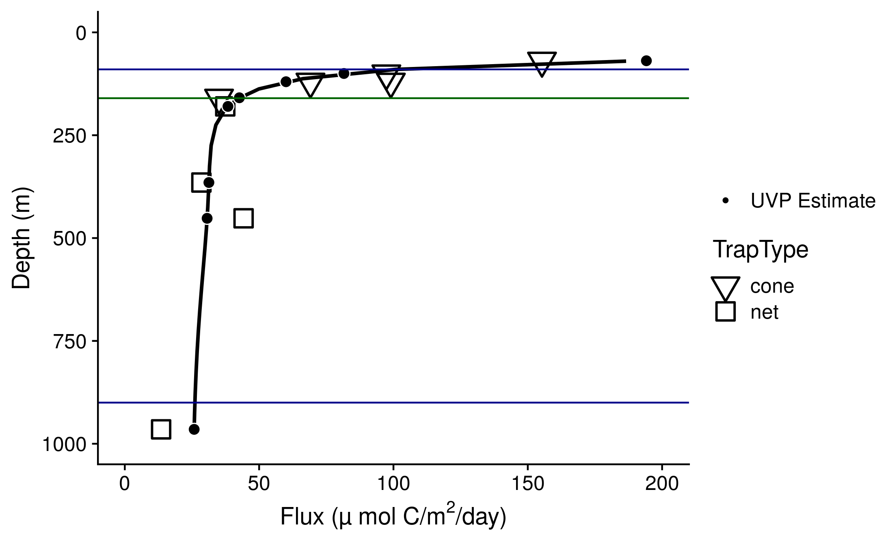
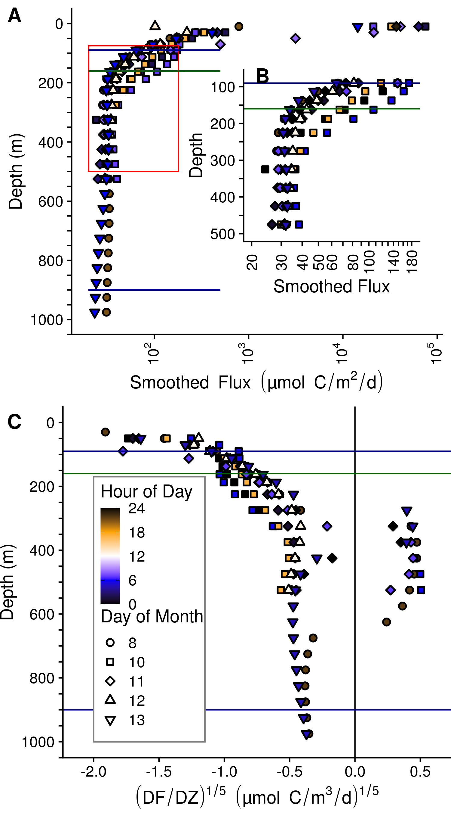
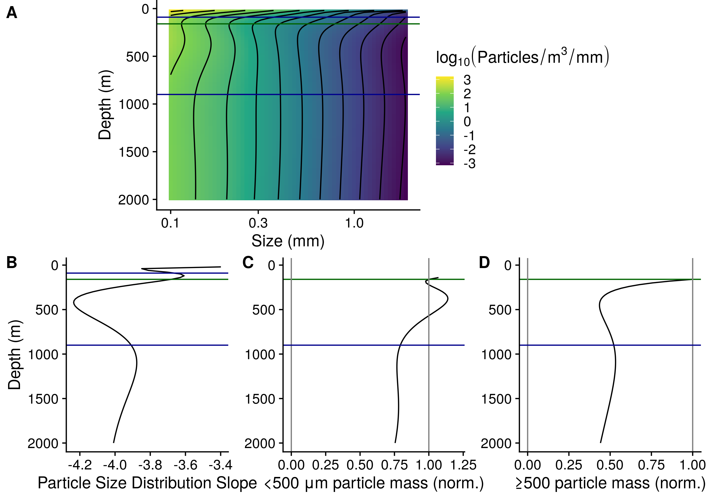
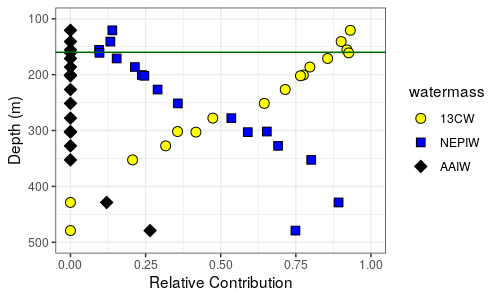
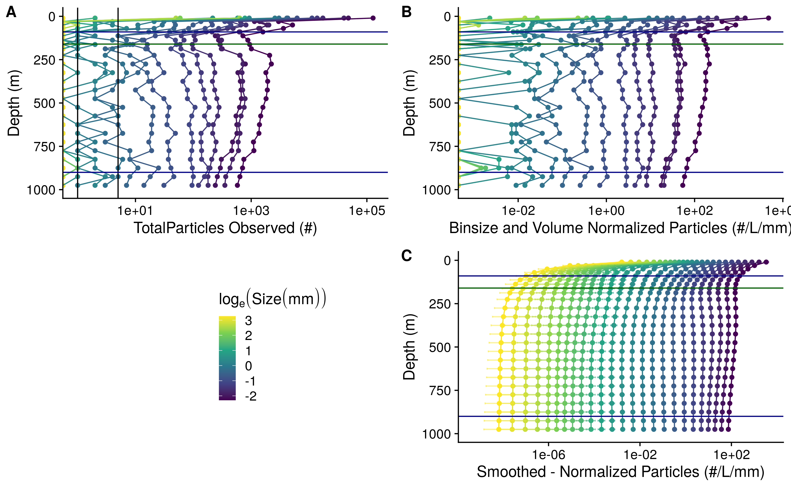
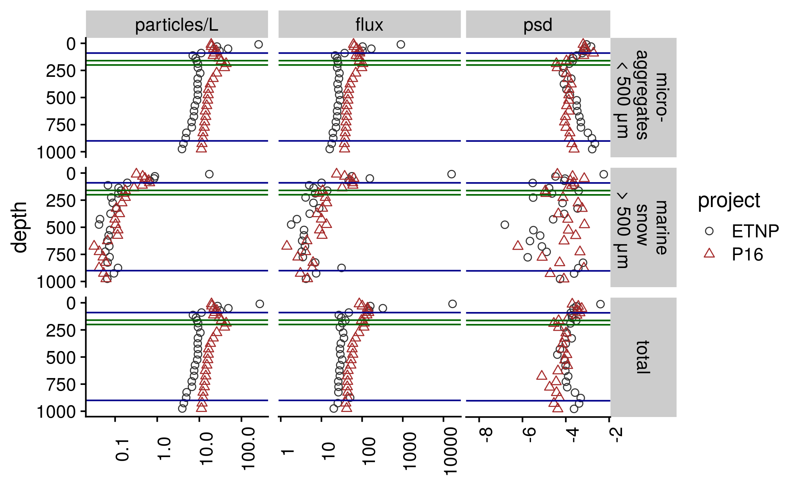

#Notes to co-authors:
I plan to target this manuscript to Global Biogeochemcial Cycles, first submitting to the pre-print server ESSOAr. This is not currently formatted for GBC, in part because I find it easier to have references with the authors names in the text when people are editing. There is a cover letter after the supplement.

The following things still need to happen:
Natalia Evans and I have some additional analyisis to discuss (does SSHA relate to disaggregation/apparent flux increases and others). Tom Weber, is looking over the math for the eularian disaggregation model. I need to format the github repository so that it can be shared, and possibly mirrored to a repository.

# Author list 
<<<<<<< HEAD
(Putative, order not set, Please suggest others. Please add your middle initial if you want to have one. Please add/confirm your ORCID, if you have one. If you don't have one, please consider creating one.)
??? Means that is the only ORCID that I could find corresponding to the authors name but no other confirming information.
=======
(putative, order not set, please suggest others, will likely expand)
Jacob Cram,
Jessica Pretty,
Megan Duffy,
Rachael L,
Clara Fuchsman,
Klaus H,
Thomas Weber,
Shirley Leung,
Jaqui N,
Allan Duvol,
Rick Keil,
Andrew McDonnel

# Abstract

Models and observations suggest that that particle flux attenuation is lower across the mesopelagic zone of anoxic environments compared to oxic ones. This attenuation is likely a function of microbial metabolism, as well as aggregation and disaggregation by zooplankton and other processes. Analysis of particle size spectra can provide insight into the relative roles of aggregation, disaggregation and remineralization. We measured particle size profiles at one station in the core of the Eastern Tropical North Pacific Oxygen Minimum Zone (ETNP OMZ) using an underwater vision profiler (UVP), at different times of day, over the course of a week. Comparing particle flux measurements from sediment traps allowed us to constrain the particle size to flux relationship, and to generate highly resolved depth and time esttemates of particle flux rates. We found that particle flux attenuated very little throughout the anoxic water column, and at some time-points appeared to increase. Comparason to the predictions models of particle dynamics in OMZs suggested slow remineralization of all sizes of particles, and disaggregation by zooplankton between the base of the photic zone and 500m. Acoustic measurements of multiple size classes of organisms suggested that many orgnisms migrated in the day to this region. Our data suggest a role of zooplankton in transporting biomass in the form of fecal pellets, into the core of the OMZ, but also in disaggregating particles in this same region. We further observe that there is temporal variability in flux transport.

>>>>>>> 9d5c624d052a34b2096a24c7a475fb72b5e3d9fe

Jacob A. Cram http://orcid.org/0000-0001-9546-1130,

<<<<<<< HEAD
Clara A. Fuchsman 0000-0002-9151-4984,

Megan Duffy,

Jessica L. Pretty 0000-0001-6542-8540 ???,

Rachel M. Lekanoff 0000-0003-3770-4151 ???,

Jacquelyn A Neibauer 0000-0001-9920-2558 ???,

Shirley W. Leung 0000-0002-6659-6420,

Klaus B. Huebert 0000-0002-2432-7337,

Thomas S. Weber 0000-0002-4445-6742,

Daniele Bianchi 0000-0002-6621-0858,

Natalya Evans 0000-0002-2726-8272,

Allan H. Devol 0000-0003-4016-9399,

Richard G. Keil 0000-0003-4132-5381 ???,

Andrew M.P. McDonnel 0000-0003-1408-4869

# Key Points

* There is low flux attenuation and a steepening of the particle size distribution slope from the base of the photic zone through 500 m at a station in the center of the Eastern Tropical North Pacific Oxygen Defficient Zone (ODZ).

* Comparason of these observations to models suggests that the breakdown of particles of all sizes is slow throughout the ODZ.

* Zooplankton appear to transport organic matter into and disaggregate particles within the ODZ, above 500m.

# Abstract (limit 250 words)

Models and observations suggest that that particle flux attenuation is lower across the mesopelagic zone of anoxic environments compared to oxic ones. This attenuation is likely a function of microbial metabolism, as well as aggregation and disaggregation by zooplankton and other processes. The concentration of different sizes of particles in the ocean, called the particle spectrum, is shaped by particle aggregation, disaggregation and remineralization processes. Observing and modeling particle spectra can provide information about the contributions of these processes. We measured particle size spectrum profiles at one station in the oligotrophic Eastern Tropical North Pacific Oxygen Deficient Zone (ETNP ODZ) using an underwater vision profiler (UVP), a high resolution camera that counts and sizes particles. Measurements were taken at different times of day, over the course of a week. Comparing these data to particle flux measurements from sediment traps that collected over the same time period allowed us to constrain the particle size to flux relationship, and to generate highly resolved depth and time estimates of particle flux rates. We found that particle flux attenuated very little throughout the anoxic water column, and at some time-points appeared to increase. Our data suggest that particles of all sizes remineralize more slowly in the ODZ than in oxic waters, and that large particles disaggregate into smaller particles between the base of the photic zone and 500 m. Acoustic measurements of multiple size classes of organisms suggested that many organisms migrated, during the day, to the region with high particle disaggregation. Our data suggest that migrating organisms both actively transport biomass and disaggregate particles in the ODZ core. Our data further suggest both within and between day variability in active transport and particle disaggregation.

# Plain Language Summary (limit 200 words)

Marine snow are tiny particles that form in the surface of the ocean and sink into the deep ocean. Most of these particles are the remains of dead algae and fecal pellets (poop) from tiny animals. The deeper the particles sink into the ocean before bacteria eat them, the longer it takes before the carbon in those particles can return to the atmosphere. In parts of the ocean where there is no oxygen many particles sink into the deep ocean and we want to know why.
We used a camera to observe marine snow particles in a part of the ocean (just west of Mexico) where there is very limited oxygen between 200 and 825 meters depth. We compared the observations to predictions of different computer simulations to see which simulations were most accurate. Our measurements suggest that one reason that particles sink into the deep ocean because bacteria don't eat the particles very quickly when there is no oxygen. Meanwhile, tiny animals break large particles into smaller ones and produce fecal pellets in these low oxygen waters.

# Introduction

The biological pump, in which sinking particles transport carbon from the surface into the deep ocean, is a key part of the global carbon cycle  [@neuerOceanBiologicalCarbon2014; @turnerZooplanktonFecalPellets2015]. Organic matter flux into the deep ocean is a function both of export from the photic zone into the mesopelegic (export flux), and the fraction of that flux that crosses the mesopelegic (transfer efficiency) [@passowBiologicalPumpHigh2012; @siegelPredictionExportFate2016; @francoisFactorsControllingFlux2002]. The transfer efficiency of the biological pump may affect global atmospheric carbon levels [@kwonImpactRemineralizationDepth2009]. Thus, understanding the processes that shape organic matter degredation in the mesopelegic is critical.

Zooplankton modulate carbon flux through the mesopelegic [@steinbergZooplanktonOceanCarbon2017; @turnerZooplanktonFecalPellets2015; @jacksonModelDistributionParticle2001], and by extension the efficiency of the biological pump [@cavanRoleZooplanktonDetermining2017; @archibaldModelingImpactZooplankton2019]. They affect particle flux through four processes: *repackaging*, *respiration*, *active transport* and *disaggregation*. Zooplankton *repackage* particles into fecal pellets that have different properties from the original particles [@wilsonChangesFecalPellet2008]. Zooplankton consume particles in the mesopelegic and *respire* some of their biomass [@stukelRolesSuspensionFeedingFluxFeeding2019]. It was found that this rate of consumption did not substantially attenuate flux in the California Current [@stukelRolesSuspensionFeedingFluxFeeding2019]. Zooplankton consume particles in surface depths and release it at others, thereby *actively transporting* carbon, usually downward [@archibaldModelingImpactZooplankton2019; @bianchiIntensificationOpenoceanOxygen2013; @hannidesExportStoichiometryMigrantmediated2009; @steinbergZooplanktonVerticalMigration2000; @stukelNitrogenIsotopeFlows2018; @stukelRolesSuspensionFeedingFluxFeeding2019]. Zooplankton break large particles into smaller ones, likely by generating turbulance when they swim [@dillingFragmentationMarineSnow2000; @goldthwaitEffectsPhysicalFragmentation2005]. This *disaggregation* can lead to increased remineralization of particles because those smaller particle pieces sink more slowly and so have longer residence times in the mesopelagic, causing them to be consumed before reaching deep waters [@goldthwaitEffectsPhysicalFragmentation2005]. In this manuscript we focus on active transport and disagggregation in particular.
      
Oxygen levels, and in particular the geographic range of anoxic regions of the water column, appear to modulate particle flux through the mesopelegic. Observations of particle flux in the region of the Easten Tropical North Pacific [@vanmooyImpactSuboxiaSinking2002; @hartnettOrganicCarbonInput1998] that is near the Mexican coast, and Arabian Sea [@keilMultiproxyApproachUnderstanding2016] have suggested lower flux attenuation in these ODZ systems. Models have shown that accounting for oxygen limitation in ODZs is necessary to fit global patterns of particle transfer [@cramRoleParticleSize2018; @devriesExportFateOrganic2017; @paviaShallowParticulateOrganic2019]. The oxygen content of the ocean is decreasing, [@breitburgDecliningOxygenGlobal2018] and the dimension of ODZs, including the ETNP ODZ are likely to change, though there is disagreement over whether they are expanding or contracting [@deutschCentennialChangesNorth2014; @strammaExpandingOxygenMinimumZones2008; @horakExpansionDenitrificationAnoxia2016]. Changes to ODZ ranges are likely to effect ocean chemistry, the habitat of marine organisms, and the interactions between between organisms and chemistry [@gillyOceanographicBiologicalEffects2013]. Models and chemical data suggest that ODZs may enhance carbon transport to the deep ocean, by inhibiting microbial degradation of sinking marine particles [@cramRoleParticleSize2018]. However, biological organic mater transport is also modulated by zooplankton [@steinbergBacterialVsZooplankton2008; @steinbergZooplanktonOceanCarbon2017] which feed on, produce and disaggregate particles, and whose interactions on particle flux in pelagic ODZs are only beginning to be explored [@kikoZooplanktonMediatedFluxesEastern2020].

Models of particle transfer through the mesopelegic oceans suggest that particle size, ocean temperature, and oxygen concentrations modulate particle flux [@cramRoleParticleSize2018; @devriesExportFateOrganic2017]. Meanwhile regional differences in particle ballasting play a smaller role. [@cramRoleParticleSize2018]. These models, however, assume that zooplankton play a small role, and therefore assume no transport through the mesopelegic, and no disaggregation. As a result of this assumption, the models predict that small particles will attenuate with depth. However, small particles have been shown to contribute substantially to flux in the deep ocean [@durkinObservationsCarbonExport2015]. Conveniently, these models' particle size predictions generate a useful null hypothesis of expexted particle size distributions in the abscence of zooplankton effects. Thus their predictions can, in principle, be compared to observed distributions of particles to explore the magnitude of zooplankton effects.
=======
* A
  + The biological pump, in which, sinking particles transport carbon from the surface into the deep ocean, is a key part of the global carbon cycle (Turner 2015; Neuer 2014) [@neuerOceanBiologicalCarbon2014; @turnerZooplanktonFecalPellets2015].
  + Flux into the deep ocean is a function of both export from the photic zone into the mesopelegic (export flux), and the fraction of that flux that crosses the mesopelegic (transfer efficiency) [@passowBiologicalPumpHigh2012; @siegelPredictionExportFate2016]. 
  + Transfer efficiency, the flux between the base of the photic zone and the deep ocean (Francois 2002) [@francoisFactorsControllingFlux2002] is  important in particular, because the depth to which carbon is transported may affect global atmospheric carbon levels (Kwon) [@kwonImpactRemineralizationDepth2009]
  + Zooplankton can affect particle flux in the mesopelegic in several ways (Turner 2015; Steinberg and Landry 2017)[@steinbergZooplanktonOceanCarbon2017; @turnerZooplanktonFecalPellets2015; @jacksonModelDistributionParticle2001], and by extension the efficiency of the biological pump  [@cavanRoleZooplanktonDetermining2017; @archibaldModelingImpactZooplankton2019].
    - (1) Zooplankton repackage particles into fecal pellets which have different properties from the original particles [@wilsonChangesFecalPellet2008].
    - (2) Zooplankton consume particles in surface depths and release it at others, thereby actively transporting carbon, usually downward [@archibaldModelingImpactZooplankton2019; @bianchiIntensificationOpenoceanOxygen2013; @hannidesExportStoichiometryMigrantmediated2009; @steinbergZooplanktonVerticalMigration2000; @stukelNitrogenIsotopeFlows2018; @stukelRolesSuspensionFeedingFluxFeeding2019].
    - (3) Zooplankton consume particles in the mesopelegic and respire some of their biomass  (Stukel et al. 2019).
      + Though it was found that this rate of consumption was less than flux in the California Current [@stukelRolesSuspensionFeedingFluxFeeding2019].
    - (4) Zooplankton  break large particles into smaller ones, likely by generating turbulance when they swim [@dillingFragmentationMarineSnow2000; @goldthwaitEffectsPhysicalFragmentation2005].
      - Fragmentation of particles can lead to increased remineralization of particles because those smaller particle pieces sink more slowly and so have longer residence times, and so have longer to break down in the mesopelegic [@goldthwaitEffectsPhysicalFragmentation2005].
      
  + Oxygen levels, and in particular anoxic regions of the water column, appear to modulate particle flux through the mesopelegic
    - Observations of particle flux in the Easternmost part of the Easten Tropical North Pacific [@vanmooyImpactSuboxiaSinking2002; @hartnettOrganicCarbonInput1998], and Arabian Sea [@keilMultiproxyApproachUnderstanding2016] have suggested lower flux attenuation in these OMZ systems.
    - Models have shown that oxygen limitation in the OMZs is necessary to fit global patterns of particle transfer[@cramRoleParticleSize2018; @devriesExportFateOrganic2017].
    - Oxygen minimum zones in the open ocean are expanding [@strammaExpandingOxygenMinimumZones2008], and this expansion is likely to effect ocean chemistry, the habitat of marine organisms, and the interactions between between organisms and chemistry [@gillyOceanographicBiologicalEffects2013]. Models and chemical data suggest that oxygen minimum zones may enhance carbon transport to the deep ocean, by inhibiting microbial degradation of sinking marine particles [@cramRoleParticleSize2018]. However, biological organic mater transport is modulated by zooplankton [@steinbergBacterialVsZooplankton2008; @steinbergZooplanktonOceanCarbon2017]  which feed on, produce and disaggregate particles, and whose interactions on particle flux in pelagic OMZs are only beginning to be explored [@kikoZooplanktonMediatedFluxesEastern2020].

   + Particle size resolved models of particle transfer through the mesopelegic oceans suggest that temperature, size and oxygen play a big role in modulating particle flux [@cramRoleParticleSize2018; @devriesExportFateOrganic2017].
     - While regional differences in particle ballast plays a smaller role. [@cramRoleParticleSize2018].
     -These models models assume that zooplankton play a small role, and therefore assume no transport through the mesopelegic, and no disaggregation.
     -They therefore predict attenuation of small particles and not large ones.
      + This assumption is questionable, given the established importance of zooplankton.
     - However, these models particle size predictions generate a useful null hypothesis that can be compared against.
>>>>>>> 9d5c624d052a34b2096a24c7a475fb72b5e3d9fe
           
Underwater vision profilers, cameras that can count and size many particles over large water volumes [@picheralUnderwaterVisionProfiler2010], provide valuable information about particle transport. When deployed in concert with particle traps in some regions, they can be used to predict flux in other regions where traps have not been deployed [@guidiRelationshipParticleSize2008; @kikoZooplanktonMediatedFluxesEastern2020]. UVP can furthermore provide resolved information about particle flux variability across space and time [@guidiRelationshipParticleSize2008; @kikoBiologicalPhysicalInfluences2017]. Connecting UVP and trap data can furthermore inform about relationships between particle size, biomass, and sinking speed, as well as the contributions of the different particle sizes to flux [@guidiRelationshipParticleSize2008].
          
A recent study combined particle size tracking, mockness tows, and acoustic data, collected at one site, with trap measurements from nearby locations, from the literature, to explore zooplankton transport in the Eastern Tropical North Atlantic, a hypoxic, but not fully anoxic, Oxygen Minimum Zone [@kikoZooplanktonMediatedFluxesEastern2020]. The authors found a particle maximum in the mesopelegic and contended that this feature suggests transport by zooplankton, and/or mortality of migrating zooplankton. The authors suggest that in more anoxic and larger ODZs, such as the modern day ETNP, and in particular or ODZs in the future, there might be less active transport into the mesopelegic than seen at their site, since migratory organisms would presumably not migrate as deeply into the water and would be less active in true ODZs In this manuscript we provide data from such a fully anoxic region.
     
<<<<<<< HEAD
A recent modeling study poses three hypotheses about why particle flux attenuates slowly in ODZs [@weberEfficientParticleTransfer2020]. These are: **HWB1:** *All* particles in ODZs remineralize more slowly than in oxic water, regardless of their size. **HWB2:** There is less disaggregation by zooplankton in ODZs than elsewhere. **HWB3:** Large particles remineralize more slowly in ODZs, but smaller ones do not. This last hypothesis was indicated by model results that suggest that large particles are diffusion limited. Therefore, microbial metabolism in their cores could also be limited by nitrate and nitrite, even though both elements are present in the ODZ core. In that case less thermodynamically efficient sulfate reduction processes [@lamMicrobialNitrogenCycling2011] would dominate [@bianchiGlobalNicheMarine2018]. Sulfide accumulation and organic matter sulfurization had been found a this site [@ravenMicrobialSulfateReduction2021], and microbial analysis of particles found sulfate reducers at low abundance [@saundersCompleteArsenicbasedRespiratory2019]. The authors of the modelling study propose that the processes undelying each hypothesis would have signature effects on particle size distribution in the core of the ETNP. The model with slow attenuation of all particles, predicts an increase in the abundance of small particles in the OMZ core, while the other two models, predict a decrease in small particle abundance, because small particles are either not replaced by disaggregaton of large particles (Model 2) or because those particles are remineralized more quickly than larger particles (Model 3). However, the authors were not able to support any hypothesis at the exclusion of the others because they did not have the necessary data about particle size. In this manuscript we present data that can test these three hypotheses (hereafter called Weber-Bianchi models).

While UVP and traps have been sampled together [@guidiRelationshipParticleSize2008], combined trap and UVP measurments have not been taken together previously in an ODZ. Globally, most of the volume of the ETNP ODZ is below regions of very low surface productivity [@fuchsmanCyanobacteriaCyanophageContributions2019; @penningtonPrimaryProductionEastern2006]. Meanwhile most flux data has been measured in higher productivity regions of the ETNP [@vanmooyImpactSuboxiaSinking2002; @hartnettOrganicCarbonInput1998]. Furthermore, the degree to which zooplankton swimming or other processes lead to particle disaggregation, both in ODZs and elsewhere in the ocean, is unknown.

To provide the data to test hypotheses and illuminate zooplankton particle interactions in oligotrophic ODZs, we collected particle size data at high temporal resolution over the course of a week in an anoxic site typical of the oligotrophic ETNP ODZ, well away from the high productivity zone in the coast. We integrated this size data with observed flux measurements, and acoustic data. We quantified, throughout the water column, how changes in size distribution deviate from changes that would be predicted by remineralization and sinking only models.

We ask the following three questions: **A:** How do the particle size distribution at one location in the oligotrophic Eastern Tropical North Pacific vary with respect to depth and time? **B:** Do our data support any of the three Weber and Bianchi [-@weberEfficientParticleTransfer2020] models? **C:** Do our data suggest regions of the oxygen minimum zone with disaggregation like processes, and if so, do these co-occur with migratory zooplankton?

We hypothesized **H1:** Temporal day to day variability in particle number, particle size distribution slope and flux would be evident. **H2:** This variability would relate to the location of migratory zooplankton, with a combination of increased particle flux and disaggregation present where zooplankton occur. **H3:** Disaggregation and particle production by zooplankton might lead to particle size patterns that cannot be explained by remineralization and sinking alone. We also will test each of the three Weber-Bianchi models, specifically that ODZs have (**HWB1**) slower attenuation of all particles, (**HWB2**) decreased disaggregation, or (**HWB3**) slower attenuation of just large particles, in the ODZ core.

=======
  + A recent modeling study posed three hypotheses, each with a prediction about particle size distributions [@weberEfficientParticleTransfer2020]
     * Weber and Bianchi [-@weberEfficientParticleTransfer2020] proposed three reasons that this could occur 
       (1) Slower attenuation of *all* particles: The rate of generalization of all particles could be slower in OMZs.
       (2) Decreased disaggregation by zooplankton: 
       (3) Slower attenuation of large particles: Large particles might harbor cores that are limited in both oxygen and nitrate and so microbial metabolism could be usually slow in these.
        - The authors proposed that these processes would have signature effects on particle size distribution in the core of the ETNP. Slower attenuation of all particles, was predicted to result in an increase in the abundance of small particles, while the other two models, would result in a decrease in small particle abundance as small particles were either not replaced by breakdown of large particles (Model 2) or as those particles were broken down more quickly than larger particles (Model 3). However, they didn't have data to determine which model best fit reality.

* B
  * The data to test each of the three the Weber-Bianchi [-@weberEfficientParticleTransfer2020] models, specifically particle size distributions and corresponding to slope, do not exist for fully anoxic OMZs of the pelegic ocean, to our knowledge.

  * Furthermore, combined measurements of particle numbers, flux and migration of plankton, while avalable in the ETNA (Kiko), have not been made in a fully anoxic region.
    - Indeed this study used trap data from earlier studies. UVP and traps have been sampled together, but not before in an OMZ.
  * While organic mater transport by zooplankton has been hypothesized to be limited in OMZs, this pattern hasn't been tested.
  * It is unknown the degree to which zooplankton swimming or other processes lead to disaggregation.
  + Most OMZ are in the oligotrophic ocean, where productivity is low [@fuchsmanCyanobacteriaCyanophageContributions2019; @penningtonPrimaryProductionEastern2006]. Meanwhile most flux data has been measured in higher productivity regions of the ETNP [@vanmooyImpactSuboxiaSinking2002; @hartnettOrganicCarbonInput1998]. 

* T
  * We targeted a site typical of the oligotrophic ETNP OMZ, well away from the high productivity zone in the coast.
  * We collected particle size data at high temporal resolution over a week
  * We compare it to observed flux measurements, and acoustic data.
  * We describe particle size distribution slope.
  * We quantify, throughout the water column, how changes in size distribution deviate from changes that would be predicted by remineralization and sinking only models.
  * Together, these analyses will provide more detailed information about the relationship between particle transport and zooplankton in the ETNP OMZ.

## Scientific questions:
 * How do the particle size distribution at one location in the oligotrophic Eastern Tropical North Pacific evolve with respect to depth, and how does it vary over time?
 * Do our data support any of the Bianchi-Weber models?
 * Do our data suggest regions of the oxygen minimum zone with disaggregation like processes, and if so do these co-occur with regions suggested to harbor zooplankton.

## We hypothesized
 * Temporal day to day variability in particle number, particles size distribution slope and flux would be evident.
 * This variability would relate to the location of migratory zooplankton, with a combination of increased particle flux and disaggregation present where zooplankton occur.
 * Disaggregation and particle production by zooplankton might lead to particle size patterns that cannot be explained by remineralization and sinking alone.
 Tested whether our data reflected predictions from each of the three Weber-Bianchi models. Specifically we asked wheter our data supported any of the following: slower attenuation of all particles, decreased disaggregation, or slower attenuation of just large particles, in the OMZ core.

 
>>>>>>> 9d5c624d052a34b2096a24c7a475fb72b5e3d9fe
# Methods
Unless specified otherwise, measurements were taken on board the R/V Sikuliaq from 07 January 2017 through 13 January 2017 at 16.5°N 106.9°W, located in an oligotrophic region of the Eastern Tropical North Pacific Oxygen Minimum Zone (ETNP Station P2; Figure 1A). Data are compared against measurements taken at 16.5°N 152.0°W on 08 May 2015, collected on the GO-SHIP CLIVAR/CARBON P16N Leg 1 Cruise (CCHDO Hydrographic Cruise 33RO20150410). This station was at the same latitude as ETNP Station P2,  west of the ODZ, where oxygen is not limiting (P16 Transect Station 100; Figure S1). 

## Water property measurements
We measured water properties of temperature, salinity, fluorescence, oxygen concentration and turbidity using the shipboard SeaBird 911 CTD.  Auxiliary sensors included a WetLabs C-Star (beam attenuation and transmission) and a Seapoint fluorometer. Data were processed with Seabird Software, (programs--data conversion, align, thermal mass, derive, bin average and bottle Summary) using factory supplied calibrations. Data was analyzed and visualized in *R*.

## Water mass analysis
Evans et al. [-@evansRoleWaterMasses2020] previously employted optimum multiparameter analysis to map the percent identify of the water observed at each depth to three water masses: the 13 Degree Celsius Water 13CW, North Equitorial Pacific Intermediate Water (NEPIW), and Antarctic Intermediate Water (AAIW). We subset and examined only the portion of these data that correspond to our site.

## Particle size measurements
Particle size data were collected by Underwater Vision Profiler 5 (UVP) that was mounted below the CTD-rosette and deployed for all CTD casts shallower than 2500 m. A UVP is a combination camera and light source that describes the abundance and size of particles from $100 \mu m$ to several centimeters in size [@picheralUnderwaterVisionProfiler2010]. Visual inspection of immages suggests that particles are primarily "marine snow" but also include a small number of zooplankton and visual artifacts. UVP data were processed using custom MATLAB scripts, uploaded to EcoTaxa [@picheralEcoTaxaToolTaxonomic], and analyzed in R. The UVP provided estimates of particle abundances of particles in different size-bins, as well as information about the volumes over which those particle numbers had been collected.

## Flux measurements

Particles were collected in free floating, surface tethered, particle traps. As part of these studies, the traps also generated data about carbon flux, which is reported here. Two types of traps were deployed. One set of traps, generally deployed in shallower water, had a solid cone opening with area $0.46m^2$. The second set had larger conical net with opening of $1.23m^2$ area made of $200\mu m$ nylon mesh. In all cases, particles collected in the net or cone fell into one of two chambers. The “plus-particles” chamber collected particles from the net and incubated them for approximately 22 hours. The top-collector trap collected particles, and then returned immediately to the surface. All flux data are form top-collectors. Carbon content of particles in each trap was measured by mass spectrometry. Mass spectrometry failed to detect any carbon in four surface traps, which were excluded from the analysis. Traps at similar depths did detect carbon, lending confidence to the idea that these non-detections were technical in nature, rather than reflecting environmental conditions.

## Analysis
All analyses were constrained to the mesopelegic, defined here as the region between the base of the photic zone (175 m), which is below the oxycline, and 1000 m. For many analyses, particles were binned by depth with 20 m resolution between the surface and 100 m, 25 m resolution between 100m and 200 m depths and 50m resolution below 200m. This increasing courseness of the bins heped account for more scarce particles deeper in the water column, while maintining higher depth resolution near the surface. To perform this binning, particle numbers, and volumes of water sampled of all observations within each depth bin were summed prior to other analyses.

Two normalized values of particle numbers were calculated. In the first, particle numbers were divided by volume sampled, to generate values in $particles/m^3$. In the second, particles were divided by both volume sampled and the width of the particle size-bins to generate values in $particles/m^3/mm$.

### Particle size distribution

We determined the slope and intercept of the particle size distribution spectrum by fitting a power law to the data. Because large particles were infrequently detected, we used a negative-bionomial general linear model that considered the volume of particles sampled, and particle bin-size and that assumed that the residuals of the data followed a negative-bionomial (rather than normal) distribution. Thus we fit the equation $ln(\frac{E(Total\,Particles)}{Volume *Binsize}) = b_0 + b_1\,ln(Size)$ to solve for the Intercept ($b_0$) and particle size distribution slope ($PSD = b_1$). Where the term on the left describes the expected volume and bin-size normalized count data, assuming a negative binomial distribution of residuals.
 
### Estimating particle flux

We estimated particle flux throughout the water column, by fitting particle data to trap measurments. We assumed that particle flux in each size bin (j) followed the equation

$$flux_j =  (\frac{Total\,Particles_j}{Volume * Binsize_i}) * C_f * (Size) ^ a $$ 
(Eqn 1.)

And where flux at a given depth is the sum of all bin specific values.
$$Flux = \sum_j{flux_j}$$ 
(Eqn 2.)

We used the `optimize()` function *R*'s `stats` package to find the values of $C_f$ and $a$ that yielded closest fits of the UVP estimated flux to each particle trap.

We also estimated the exponent of the particle size to biomass exponent $\alpha$  and size to sinking speed exponent $\gamma$ per the equations $Biomass_j \sim Size_j^\alpha$ and $Speed_j \sim Size_j^\gamma$. This is done by assuming a sperical drag profle, in which case $a = \alpha + \gamma$ and $\gamma = \alpha -1$ [@guidiRelationshipParticleSize2008].

### Size specific information

We separately analyzed total particle numbers, particle size distribution, and particle flux for particles larger than or equal to $500~\mu m$, and those smaller than $500~\mu m$, to determine the relative contributions of these two particle classes to particle properties.

## Variability
We used a general additive model, of form $Flux \sim s(Depth) + s(Day) + s(Hour)$ to explore whether estimated flux levels appeared to vary by day and hour, holding the effects of depth constant, in the 250 m to 500 m region. The smooth terms *s* for "Depth" and "Day" were  thin plate splines, while the *s* term for "Hour" was a cyclic spline of 24 hour period.

## Modeling remineralization and sinking
We modified the Particle Remineralization and Sinking (PRiSM) model, as described by DeVries et al. [-@devriesMechanisticParticleFlux2014] to estimate particle size distributions at each depth in the water column from (1) the particle size distribution in the depth bin above, and (2) the estimated change in flux between the two depths (which is itself calculated from the two observed distributions) (Supplement). The model generates a predicted profile at the deeper depth, which is compared to the observed profile at that same, deeper, depth.

# Results

## Physical and Chemical Data
The anoxic zone, characterized by undetectable oxygen levels, extends from 80 m to 850 m depth, with a sharp upper oxycline and a gradual lower oxycline (Figure 1B-D). The upper oxycline tracks a sharp picnocline (Figure 1C-1D), set by the high salinity of the 13C water mass (Figure S2) , characterized by a abrupt drop in temperature below the mixed layer, and an increase in salinity (Figure 1B).  The site is characterized two fluorescence maxima (Figure 1C). The larger, shallower fluorescence peak is positioned just above the oxycline, ending exactly where oxygen reaches zero. The smaller, lower peak is positioned entirely inside of the anoxic zone. Turbidity tracks the two chlorophyll peaks in the surface, and has a tertiary maximum at the lower oxycline (Figure 1D). Water mass analyis indicated that water in the top part of the ODZ is dominated by the fully anoxic 13C water mass, while water below 400m is primarely from the NEPIW which is typically suboxic, as measured by more sensitive instrumentation than that employed in this study [@evansRoleWaterMasses2020; @larsenSituQuantificationUltralow2016].

## Acoustic data reveal diel migration patterns

Acoustic data, produced by the shipboard EK60 [@andersenNewSimradEK602001], suggest the presence of multiple cohorts of migratory organisms. We focus initially on  backscattering measurments from the EK60's lowist frequency 18000 Hz signal, because it travels furthest into the water column and has the best resolution of the channels. Most migratory organisms appeared to leave the surface at dawn and return at dusk, spending the day between 250 and 500m (Figure 2A). There appeared to be two local maxima in backscattering intensity at mid-day, one at ~300m and one at ~375 m (Figure 2A). There also appeared to be organisms that migrated downward at dusk and upward at dawn , spending the night at ~300m (Figure 2B). There was a peak of organisms that appeared, at mid-day, on some but not all days, without any visible dawn or dusk migration just above the base of the photic zone. (Figure 2C). Some diel migrators appeared to cross the ODZ and spend the day below the detection range of the EK60 (Figure 2D), as well as organisms that appeared between 500m and 1000m but did not appear to migrate to or from that depth at our site, but rather traveled through the the EK60's field of view (Figure 2D). 

Similar patterns were evident each other measured frequency, with better resolution by the lower frequencies (Figure S3). 

## Flux data from traps
Flux measurements at station P2 were consistent between the different particle trap types, showing a profile that broadly followed a power law with respect to depth, with the exception that flux appeared to increase in one trap at 500m (Figure 3).

## Particle abundance measurements vary with size and depth
In all profiles, particle abundances were highest at the surface, and highest among the smallest particles (Figure S4). Visual examination of the relationship between particle number and size suggested a power law relationship where the log of volume and bin-sized normalized particle abundance was proportional to the log of the particles' size (Figure S5). The exception to this pattern were particles larger than 10 mm (Figure S4), which are rare enough that they are usually not detected by the UVP. Generalized linear models that assume a negative-binomial distribution of the data accounted for this under-sampling of large particles to estimate power law slopes, while considering rare occurrences of the large particles at each depth (Figure S5). 

Total particle numbers were generally similar between different casts, regardless of which day or hour they were collected (Figure 4A). Particle numbers were highest in the surface and decreased rapidly, flattened out over the 250 m to 500 m range, decreased again until the lower oxycline, and then increased below the oxycline (Figure 4A). 

The particle size distribution slope steepened (became more negative) between the surface and 500m, flattened (became less negative) between 500 m and 1000 m, and then steepened again after 1000 m (Figure 4B). Steeper, more negative, slopes indicate a higher proportion of small particles relative to large particles, while flatter, less negative, slopes indicate a higher proportion of large particles.

## Estimated particle flux sometimes increases with depth in the ODZ core
Our optimization approach suggested that there was greatest agreement between estimates of trap observed particle flux, and UVP estimated particle flux when the particle size to flux relationship was governed by the ratio $Flux = 133 * Size ^ {2.00}$. Applying this fit to the UVP data resulted in a UVP predicted flux profile that broadly fit the expected trap observed flux profiles.

Particle flux profiles varied notably between casts between the base the photic zone and 500 m (Figure 5A-5B). Between 250 m and 500 m particle flux appeared to increase on some, but not all, casts, while attenuating slowly on the other casts (Figure 4C). Below 500 m, there were not enough casts to measure variability between casts.

General additive models that examined the rate of change of flux between 250 m and 500 m found that, after removing the effect of depth, there was a statistically significant relationship between day of the week and the fifth-root transformed, rate of change of flux (hereafter "flux-change") (*p* = 0.002), as well as between hour of the day and flux-change (*p* = 0.040) (Figure S6). There were increases in flux over this region towards the beginning and end of the sampling period, and lowest near day 10. There was also increases in flux in the daytime relative to night-time. By comparing three general additive models, one that considered only depth, one that considered depth and day of the week, and on that considered depth, day of week, and time of day, we found that  depth accounted for 37% of the variance, adding day of the week accounted for an additional 18% of the variance, and hour of the day accounted for 8.7% of the remaining variance in transformed rate of change of flux. If the fifth root transformation was not applied to the rate of change of flux, the hourly pattern was not evident. Increases in flux in this region were clearly not limited to the daytime, as one midnight cast showed increases here as well (Figure 5C).

## ETNP particle dynamics differ from those seen at an oxic site

The oxic site, P16 Station 100, was characterized by a more gradually sloping picnocline, and an oxygen minimum at 500 m of 19.7 $\mu~M$, which is not anoxic (Figure S1B). There was no working fluorescence sensor on that cruise, but data from world ocean atlas [@boyerWorldOceanAtlas2018] suggest that the photic zone is characterized by a single fluorescence peak with a maximum at 110m and which disappeared at 200m (Figure S1C). Turbidity followed chlorophyll concentration and did not have a peak in the mesopelegic (Figure S1D), unlike the ODZ site. There was a salinity peak at 150m (Figure S1B).

Particle numbers were higher, between the base of the photic zone through 1000 m at the ETNP ODZ site, than at the same-latitude, oxygenic P16 station 100 (Figure S7A). Particle size distributions were similar between the two sites above 500 m, being characterized by overlapping confidence intervals by generated by a general additive model. From 500 m to 1000 m, particle size distributions were  steeper at the ETNP site, being characterized by a higher proportion of small particles (Figure S7B). 

Small particles (100 $\mu$m - 500 $\mu$m) at the ETNP ODZ site were about two orders of magnitude more common than large particles (>= 500 $\mu$m) (Figure S8). Large particle numbers appeared to attenuate more quickly than small particles, and more generally follow a power law decrease, while small particles appeared to increase around 500 m. Flux was predicted to be predominantly from small, rather than large particles, at all depths except the very surface. The particle size distribution, calculated only on large particles, was more variable between depths than calculated for small particles. Data from the oxic P16 station 100 suggested more particles, steeper particle size distribution, and more flux than at this station than at the ETNP station. They also suggested that differences between large and small particles, with respect to number, flux and size distribution that were broadly similar to the ones seen at ETNP Station P2.

In contrast to the anoxic station, at the oxic station, flux always decreased with depth (Figure S9A+B).

## Smoothed and averaged data

Highly smoothed particle data suggested that particle size, averaged across all casts, followed a pattern in which the abundance of small particles increased between the oxycline and 500 m (Figure 6A), which corresponded with steepening of the particle size distribution (Figure 6A), an increase in small particle biomass (Figure 6B), but not of large particle biomass (Figure 6C). Deeper in the ODZ, the small particle number, particle size distribution slope, and biomass of small particles declined. At the oxic site, particle size distributions generally steepended with depth, while both small and large particle estemated biomass followed a power law decrease with depth (Figure S10).

## Particle number dynamics differ from model expectations

The modified particle remineralization and sinking model to predicted particle size distributions at each depth from the particle size distribution one depth-bin shallower and the calculated flux attenuation between the two depths. We found that the observed particle size distributions usually varied from model expectations (Figure S11). Tautologically, at each depth, the observed size profile and the model predicted size profiles have same flux. However, the difference between the flux of observed and predicted *small particles* ($100-500 \mu m$), normalized to depth, serves as a metric of patterns of deviations from modeled results. We call this value *Deviation from Model* (DFM).

$$ DFM = \frac{(Small\,Flux\,Observed - Small\,Flux\,Modeled)}{\Delta Z}$$             

Eqn. 3

In the above equation $\Delta Z$ is the distance, in meters, between the current depth bin and the previous depth bin, whose particle size distribution is fed into the predictive model.

DFM was positive between the photic zone and 500 m, meaning that less small flux attenuated than would be expected from the *PRiSM* model in this region. There was some variability in the DFM parameter between casts. A general additive model, after factoring out the effect of depth, found that there was a statistically significant relationship between day of the cast and DFM with highest values near day 10 of the study (which is when flux attenuation in this region was lowest) (*p*=0.01) (Figure S12). However there was not a statistically significant relationship between hour of the day and *Deviation from Model*.

Below 500 m, DFM was negative. There were only two casts that reached below 500m at this station, and so an analysis of the dynamics of DFM in this region are not possible.

At P16 Station 100, DFM was positive between the base of the photic zone and 350m and negative below 350 m (Figure S9C).

# Discussion

## Diel migrators spend time in the ODZ core

Organisms of all sizes appear to migrate into the core of the ODZ at our site. Most migrators appear to leave the surface at dusk, spend the day in the top 500m of the ODZ in the day and return to the surface at dusk (Figure 2A), while others show the opposite pattern, leaving the surface at dusk and returning at dawn (Figure 2B). Diel migration is prevalent throughout the oceans [@haysReviewAdaptiveSignificance2003; @cisewskiSeasonalVariationDiel2010; @heywoodDielVerticalMigration1996; @jiangTemporalVariabilityZooplankton2007; @rabindranathSeasonalDielVertical2011; @yangDielVerticalMigration2019; @sainmontInterIntraspecificDiurnal2014], including other ODZ sites [@antezanaSpeciesspecificPatternsDiel2009; @kikoZooplanktonMediatedFluxesEastern2020; @riquelme-buguenoDielVerticalMigration2020], including highly anoxic sites with secondary, anoxic deep chlorophyl maxima like this one [@hidalgoOntogeneticVerticalDistribution2005], and much of the ETNP ODZ [@herreraVerticalVariabilityEuphausia2019]. Sampling efforts elsewhere in the ETNP suggest that many of of these diel migrators are euphausids and fish [@maasFinescaleVerticalDistribution2014; @wishnerZooplanktonEasternTropical2013], and that diel migrators are primarely 2-5 mm in size [@wishnerZooplanktonEasternTropical2013]. Krill in the Humboldt current ODZ migrate to the surface at night [@riquelme-buguenoDielVerticalMigration2020], as seen for some organisms at our site (Figure 1B). The presence of organisms that appear and disapear just above the base of the photic zone, in the region of the deeper anoxic fluorescence peak region, but abscence of a tell-tale signature of mass migration before or after they appear (Figure 1C) may suggest that these organisms migrate at different times of the day to this deep region, rather than all at once. Another possiblility is that they pass through our station at this depth in mid day, but do not migrate to depth at this location, but rather at another location.

The organisms that appear between 500 m and 1000 m (Figure 2E) have acoustic signatures that resemble jellyfish [@kaartvedtDielVerticalMigration2007]. That they appear in horizontal bands that do not appear to trend upwards over time suggests that they are traveling through our site at progressively shallower depths over the course of the day, but that individual swarms are not themselves moving upward at this station. This suggests that any vertical migration carried out by these organisms happens elsewhere, or occurs more slowly than the advection seen at this site. That they appear at different depths at different times of the day suggest that these organsims have some sort of vertical migration pattern. Future work may consider more highly resolved spatial and temporal monitoring of this phenominan. Indeed molecular surveys have found evidence of both Cnidarians and Ctenophores both within and below the the ETSP ODZ near Chile [@parrisMicrobialEukaryoteDiversity2014].

## Flux is lower at this site than previous measurements in the ETNP 

<<<<<<< HEAD
Flux at our site is lower at all depths than seen in previous measurements by traps at other, more productive, ODZ sites [@vanmooyImpactSuboxiaSinking2002; @hartnettOrganicCarbonInput1998].
=======
Flux here is lower at all depths than seen in previous measurements by traps in the OMZ [@vanmooyImpactSuboxiaSinking2002; @hartnettOrganicCarbonInput1998]. This difference is expected, because the previous measurements were taken nearer to the coast, where surface chlorophyll is higher than at our site. 
>>>>>>> 9d5c624d052a34b2096a24c7a475fb72b5e3d9fe

## The flux to size relationship is typical of other sites

The exponent of the particle size to flux relationship  that we saw at our site 2.00, is of a similar magnitude to, but slightly smaller than, those seen by other studies that compare UVP flux to trap flux [@guidiRelationshipParticleSize2008; @kikoZooplanktonMediatedFluxesEastern2020]. Differences in the size-flux relationship could indicate that this relationshipb truly varies between sites, or that imprecision in flux measurements leads to differences in these values between studies. Indeed, we found this value was sensitive to outlying data points.

## Remineralization rates of all particles decrease in the ODZ, but disaggregation does not

Particle size profiles, particle size distribution slopes, and estimated biovolume, averaged across all casts and smoothed, are all similar to the predictions made by Weber and Bianchi's [-@weberEfficientParticleTransfer2020] "Model 1". (Figure 5), and therefore our hypotesis **HWB1**. This suggests that the low oxygen at this site decreases the particle remineralization rate of all particles, including small ones. It does not support the Weber-Bianchi Model 2 in which remineralization is suppressed in the ODZ, nor their Model 3 in which only the very large particles' remineralization is slowed. The data at the oxic site, generally conformed to Weber and Bianchi's "Model 0" [-@weberEfficientParticleTransfer2020], which was their prediciton for particle distributions at oxic sites. However, one difference was that the observed particle size distribution, while essentially constant from the base of the photic zone through 1000 m, appeared to steepen between 1000 m and 2000 m, suggesting an increase in the abundance of small particles, relative to Model 0. This could indicate increased disaggregation in this region or horizontal transport of small particles through advection in this region.

## Zooplankton likely transport organic mater into the ODZ core

Predicted flux levels sometimes increase between 275 m and 625 m, and at all other times attenuate very slowly in this region. The EK60 data suggest the diel migration of all sizes of organisms to this region. Taken together, the concurrent increase in flux with diel migration suggests that zooplankton are transporting of organic matter. That the rate of change in flux with depth varies between days suggests some day to day variability in this transport. That flux is highest in the day, on average, suggests that the diel migrators may be contributing to this flux, but the fact that this diel variability is small compared to overall variability suggests that additional factors may modulate active transport, and that nocturnal migrators may also play a role in carbon transport.

## Zooplankton likely disaggregate particles in the ODZ core
The observation that there is greater flux by small particles (< 500 $\mu m$) than would be predicted by remineralization and sinking alone (Figure 7), between the photic zone and 500 m suggests that some process is disaggregating large particles into smaller ones. That this apparent disaggregation corresponds with the region where migratory organisms are found suggests that some of these organisms, likely small animals such as copepods and euphausids [@herreraVerticalVariabilityEuphausia2019; @maasFinescaleVerticalDistribution2014], may break down particles  [@goldthwaitEffectsPhysicalFragmentation2005; @dillingFragmentationMarineSnow2000]. While other processes such as horizontal advection of water containing small particles [@inthornLateralParticleTransport2005] could be responsible for this increase in small particles in principle, there is no reason to expect horizontal differences at this site, which is at the core of the ODZ and far from shore.

Other deviations from model assumptions could also explain the increase in small particles relative to model predictions. For instance, if the model's assumed relationships between size, flux, sinking speed and biomass are not all accurate, particle dynamics might differ from our predictions. In particular, small partilces might break down more slowly than large ones, or sank more quickly for their size than expected, as has been seen elsewhere [@mcdonnellVariabilityAverageSinking2010]. Our model assumes a spherical particle drag profile, such that the particle sinking speed fractal dimension ($\gamma$) is one less than the particle size fractal dimension ($\alpha$) [@cramRoleParticleSize2018; @guidiRelationshipParticleSize2008], and that these two values sum to the particle flux fractal dimension. If any of these assumptions do not hold, or if our calculation of the particle flux fractal dimension was in error, the magnitude of the values may differ.

In contreast to the upper ODZ core, there is an apparent flattening of the particle size distribution below 500 m, beyond the expected effects generated by particle remineralization. This could suggest aggregation processes [@burdParticleAggregation2009]. Indeed, aggregation could be occurring throughout the ODZ core, but only exceed disaggreation in the lower ODZ region.

## Water mass changes may affect particle flux and size changes
The observation that particle flux begins to attenuate below 500m more quicly than it does between the base of the photic zone and 500m could be explained in part by a shift in water mass from NEPIW to AAIW that occurs at this depth (Figure S2). As AAIW is suggested to have higher (though still unmeasurable by our sensors) oxygen concentration than overlying waters [@evansRoleWaterMasses2020], it is possible that the particle remineralization rate is higher in the deeper OMZ. Furthermore, the decrease in the abundance in small particles, and steepening of the particle size distribution could also result from this faster remineralization of small particles. This change in watermass coencides with the lower limit of the depth to which vertically migrating zooplankton travel (Figure 2), and so we are not able to deconvolve the effects of water mass changes from that of changes in zooplankton effects.  It will be valuable for futue projects to deconvolve the effects of introduction of trace oxygen by AAIW below 500m from the effects of the abscence of zooplankton same region. The change in water mass between 13CW and NEPIW, around 250 m, in contrast, does not appear to correspond to any apparent changes in particle flux or size, even though only the 13CW is thought to be tuly anoxic, with the NEPIW also harboring trace oxygen concentrations [@evansRoleWaterMasses2020; @larsenSituQuantificationUltralow2016]. 

## Revisiting Hypotheses

Our data provide the first combined look at the relationship between particle size, particle flux, and migratory organisms. Our data support only the first of the three Weber-Bianchi hypotheses [@weberEfficientParticleTransfer2020], that particles of all sizes remineralize more slowly in ODZs **HWB1**. It *did not support* the hypotheses that disaggregation is lower in the ODZ **HWB2** , *nor* that the largist particles degraded particularly slowly in ODZs **HWB3**.This result is are consistent with previous microbiology of ETNP particles at the same station that only found sulfate reducers at low levels [@saundersCompleteArsenicbasedRespiratory2019]. 

While we hypothesized temporal within and between day variability in particle size, number and flux **H1**, we only observed statistically significant temporal variability in flux, and this variability was relatively small, compared to the total amount of flux. Flux was, in general, highest in the day-time, suggesting transport by diel migrators, but this variabiliy was not very strong. This suggests, that particle sinking speed may be slow enough that the diel migratory patterns of zooplankton occur on a shorter time-scale than that at which particles sink out of different water column layers. Future measurments of particle sinking speeds in this region would help to zero in on these time scales. That the decreased flux attenuation happened more in the day, and primarely in the DVM region supported our hypothesis **H2** that changes in flux corresponded with migrator abundances.

Our data supported our hypothsis particle size patterns cannot be explained by remineralization and sinking alone **H3**. Indeed the abundance of small particles above 500m, suggested either the presence of disaggreagation, and/or other processes.

## Opportunities for future directions

Our model can produce particle remineralization rate estimates and show how this rate changes throughout the water column. We did not include those estimates in this manuscript, because those the estimates appear to be influenced by active transport into the Diel Vertical Migration (DVM) region. However, with corrections, or by focusing on the ODZ region below the DVM, it may be possible to estemate particle remineralization rates in ODZs from UVP measurments, and possibly compare these to variations in temperature and oxygen concentration, which we have previously suggested to influence particle remineralization rates [@cramRoleParticleSize2018].

We have only done these calculations at one station. We focused on one station in order to quantify within and between day variabiliy, and found this variability to be present, but low. Thus, it is now possible to apply this sort of analysis to measurments that we and others have collected in the ETNP, and to future measurments in the  ETNP or other ODZ regions, to test whether our model confirms Weber and Bianchi’s [-@weberEfficientParticleTransfer2020] model (**HWB1**), that particles of all sizes break down more slowly in ODZs, applies elsewhere. 
Similarly, a clear next step is to apply our disaggregation model to other ocean regions. Indeed data are already collected by other groups [@guidiRelationshipParticleSize2008; @kikoBiologicalPhysicalInfluences2017; @kikoZooplanktonMediatedFluxesEastern2020]. As temporal variability only has a relatively small role, it may be reasonable to explore disaggregation like processes even when data at many locations are only collected once.

<<<<<<< HEAD
=======
## Caveats

* The disaggregation model leaks. We dealt with this by optimizing the remineralization paramter. 
* We don't see particles smaller than some size, and undersample large particles. Large particles could in fact, as Weber and Bianchi suggest, break down slowly, but we may not have detected such patterns due to undersampling.
* Our disaggregation model makes many assumptions. We contend that disaggregation is a likely scenario, but not the only one.
* Currents may play a role in transporting particles into our envonrments horizontally -- it is generally thougt that advection can be ignored in environments like this one where flus is faster than the rate at which water advects in from different environments. However if some particles are neutrally bouyant or otherwise very slowly sinking, it may be relevant to look at how particles may be moving horizontally.

## Opportunites for future directions
* Our model can estemate the remineralization paramters. It may be possible to identify the effect of oxygen and temparature on remineralization from size profiles and compare these parameters to estemates by Cram et al.

* Explore whether Weber-Bianchi model 1 holds in other OMZ environments.

* Since temporal variability only has a smallish role in stuff, it may be reasonable to explore disaggregation like processes without the time-series in other environements, such as globally.

* More explicitly consider temporal variability in sinking speed and currents.

>>>>>>> 9d5c624d052a34b2096a24c7a475fb72b5e3d9fe
# Conclusions

Particles of all sizes appear to remineralize more slowly at this ODZ site than in oxic sites. Furthermore, it appears that diel migratory organisms both disaggregate particles and transport carbon throughout the top 500m of the water column. Day to day and within day variability in organic matter transport was evident, though overall patterns in particle size, flux and disaggregation appeared to be consistant over the course of the time-series.

# Figures

Figure 1. Overview of the geography, physics and chemistry of ETNP station P2 **(A)** Map of the ETNP Oxygen Minimum Zone and the location of station P2. Colors indicate chlorophyll concentrations at the surface, while the red outline signifies the region containing low oxygen. The red circle indicates the location of Station P2. (B-D) Oceanographic parameters collected from a cast at 2017-01-13 12:15 CST (local time). All profiles contain a plot of oxygen concentrations. When available, the thin horizontal green line shows the location of the base of the photic zone (160m), while the horizontal blue line shows the base of the oxycline. Figures B and D also show density (Dashed Gray Line). (B) highlights temperature and salinity. (C) fluorescence, focusing on the top 300m of the water column, and (D) beam attenuation.

Figure 2. Acoustic data, measured by EK60, measured over the course of the experiment. Shown are data from the 18000 Hz frequency band, which have highest depth penetration, but which appear to co-occur with data from other frequency bands (see Figure S3). Values are in return signal intensity and have not been normalized to observed biomass. Several interesting patterns can be seen. **A.** Two bands of organisms can be seen leaving the surface at dawn, spending the day between 250 and 500m and returning to the surface at dusk. **B.** Another group of nocturnally migrating organisms can be seen leaving the surface at dusk, spending the night near 250m and returning at dawn. **C.** Some organisms appear at the base of the photic zone, during some, but not all mid days, and then disappear in the evening. **D.** A group of very deep migrating organisms appears to leave the surface with the diel migrators and pass all the way through the ODZ and out of the EK60's field of view. It returns at dusk. **E.** Swarms of organisms appear between 500 and 1000m disappearing later in the day. Swarms appear in the deepest layers at night and appear progressively shallower as the day progresses.

Figure 3. Particle flux, measured from sinking traps large symbols. Data from the "plus particles" and "top collector" samples from both cone and net traps were collated to generate these data. Trap types are shown by the shape and color of the large points. Superimposed are binned estimates of particle flux generated by fitting the sum of particle numbers all four profiles, binned as in Figure X, to the trap observed flux. The four points enclosed by the rectangle are unusually low compared to other traps collected at the same depth, and were therefore excluded from the fit. {Convert UVP points to a line, maybe leave points where the traps ares}

Figure 4. (A) Observed, volume normalized total particle numbers from 9 casts taken at different times of the day at ETNP station P2. (B) Calculated particle size distribution slopes of those particles. These data have not been binned by depth.

Figure 5.  Within and between day variability in UVP predicted particle flux at ETNP station P2. Profiles are compared against P16 station 100, a non ODZ station at similar latitude in the tropical pacific. All profiles are depth binned with higher resolution towards the surface (methods).  **(A)** Flux profiles in the top 1000m of the water column. **(B)** A more detailed depiction of the area enclosed by the rectangle in **A**. **(C)** The rate of change of flux, divided by the rate in change in depth. We show the fifth root of these values in order to highlight differences between values close to zero.

Figure 6. **(A)** GAM smoothed bin-size and volume particle numbers at each particle size class. **(B)** Particle size distributions. And estimated biomass of **(C)** Small and **(D)** Large particles. 

Figure 7. Quantification of non remineralization and sinking like processes. *Deviation from Model* indicates the difference between the observed small particle flux, and the flux that would be estimated if particles from the size distribution in the depth bin above remineralized and sank only following the PRiSM model. Values are normalized to the change in depth. Thus values are $\mu$mol Carbon/m3/day.

# Supplemental Figs
[move to supplement]

Figure S1. Physical and chemical data from P16 Station 100. Located at 16.5°N 152.0°W. (A) Map of the nearby tropical pacific station P6 Station 100. Colors indicate chlorophyll concentrations at the surface, averaged over all MODIS images. The red circle indicates the location of Station P2. (B-D) Oceanographic parameters. The thin horizontal green line shows the location of the base of the photic zone (200m m). **A** Oxygen, and fluorescence. Because the fluorometer was broken on this cruise, fluorescence data were pulled from world ocean atlas. **B** Oxygen temperature and salinity. **(C)** Beam attenuation and density, calculated from the salinity temperature and pressure data.

Figure S2. Water mass analyis indicates the relative contributions  proportions of the three primary water masses at this site, $13^\circ C$ water (13CW), North Equitorial Pacific Intermediate Water (NEPIW) and Antarctic Intermediate Water(AAIW). Values indicate relative contributions of each water mass and are scaled so as to sum to one. Data are taken directly from Evans et al. [-@evansRoleWaterMasses2020].

Figure S3. Acoustic data, measured by EK60, measured over the course of the experiment. Shown are data from the all frequency bands. Values are in return signal intensity and have not been normalized to observed biomass.

Figure S4. A profile of particle abundances at different sizes and depths. **(A)** Numbers of observed particles and **(B)** particle numbers normalized to volume sampled and particle size bin width. **(C)** Smoothed and extrapolated particle abundances, based on a negative binomial GAM that predicts particle abundance form size and depth.

Figure S5. An example of observed particle size distribution spectra. These are depth binned data from between X and X m deep in the water column from the cast that occurred at *DATETIME for stn_043*. A total volume of XXX L of water are sampled herein. Points indicate **(A)** total numbers of observed particles and **(B)** particle numbers normalized to volume sampled and particle size bin width. The line indicates the predicted best fit line of the data. The line was fit on the bin and volume normalized data by a negative-binomial general linear model. The line in panel **A** indicates predictions from this same model, re-scaled into absolute particle space.

<<<<<<< HEAD
=======

Figure S5. (A) Observed, volume normalized total particle numbers from 9 casts taken at different times of the day at ETNP station P2. (B) Calculated particle size distribution slopes of those particles. These data have not been binned by depth. {Axes are backward}
>>>>>>> 9d5c624d052a34b2096a24c7a475fb72b5e3d9fe

Figure S6. GAM predicted effects of **A** Depth, **B** Day of the month in January 2017, and **C** hour of the day on the fifth-root transformed, depth normalized, rate of change of flux. Y axis indicates the value of the component smooth functions effect on Flux. Positive values associate with times and regions of the water column where flux is increasing, holding other factors constant, and negative ones where it is decreasing.

 Figure S7. As above, but for the final cast taken at ETNP station P2 and the only cast collected from the P16 transect at the station 100. P16 Station 100 was chosen because it is at a similar latitude to ETNP station P2. (A) Total particle numbers, (B) Particle size distribution. **{Cut to 1000m}**
 
 
Figure S8. Depth binned particle number (volume normalized), particle size slope (PSD), and flux (estimated as in Fig. 4) for large ($>= 500\, \mu m$), small ($< 500 \, \mu m$) and total particles, at the oxic and anoxic site
 

Figure S9. Flux profiles and flux attenuation at P2 Station 100. **(A)** Flux profile **(B)** Fifth-root transformed depth normalized rate of flux decrease. **(C)** Difference between observed and modeled results. Higher values suggest more disaggregation-like processes.

Figure S10. The same profiles as shown in Figure 5, but for the oxic site P16 Station 100. **(A)** GAM smoothed bin-size and volume particle numbers at each particle size class. **(B)** Particle size distributions. And estimated biomass of **(C)** Small and **(D)** Large particles. 

Figure S11. An example of differences between modeled and observed particle slope. The particle size distribution at a shallow and deeper depth are shown. The model generates a prediction of the deep depth profile form the shallow depth profile and the flux attenuation between the two profiles. The model predicts more attenuation of the smallest particles than it actually observed. In practice the model compares depths that are closer together than the two shown here. Two depths that are far apart are shown so that the flux attenuation is large enough to be seen by eye and to provide a conceptual example of the models' function.

Figure S12. GAM predicted effects of **A** Depth, **B** Day of the month in January 2017 Y axis indicates the value of the component smooth functions effect on the difference between observed and modeled flux. Thus higher values correspond with greater flux of small particles than predicted by the model.

# Cover Letter

Dear Editor,
      We present for your consideration, our manuscript entitled Particle size and abundance measurements suggest temporally variable biotic transport and disaggregation in the Eastern Tropical North Pacific Oxygen Minimum Zone. This manuscript presents a time-series of measurments of particle size and abundance in the Eatern Tropical North Pacific Oxygen Deficient zone. Our particle size measurments are complemented by the first set of by trap based measurments of carbon flux taken in the oligotrophic section of the ETNP-OMZ and acoustic measurments of zooplankton abundances.
   
Oxygen defficient zones have the capacity to regulate the global carbon cycle, because carbon flux attenuates more slowly in the mesopelegic when those waters are anoxic. However there is some uncertaintly about why carbon flux attenuation is so low in this region. Our measurments support the to predictions of models that suggest that all particles are consumed more slowly by bacteria in OMZs. In contrast, they do not conform to he predictions models that suggest that zooplankton activity is supressed in OMZs, or that only large particles break down slowly. Furthermore, by comparing our observations to the predictions of another model, we provide a depth resolved estemate of the rate at which zooplankton disaggregate large particles into smaller ones. It appears that this a apparent disaggregation is highest where acoustic data suggest abundant zooplankton. By examining day to day variability, we also show that the patterns that we observe are representiative of conditions in the core.

We think this manuscript will be of interest to readers of GBC because it settles some important questions about how oxygen minimum zones regulate the carbon cycle. In particular it presents evidence that microbial breakdown of particles is slow in this region, even though there are abundant electron acceptors in the form of nitrate and nitrite, and that zooplankton still play an important role in particle transport and breakdown, even though there is not oxygen for them to breathe in this region.

Sincerely,
Jacob Cram

# Suggested Reviewers

<<<<<<< HEAD
[co-authors, please add your favorites, we need at least 3].
Rainer Kiko
=======
## Talk about

Different community vs oxic things.

Wishner -- there is a peak of biomass at lower OMZ -- lower oxycline

Directions -- 
Progression -- models and can actually test hypotheses for proposal
>>>>>>> 9d5c624d052a34b2096a24c7a475fb72b5e3d9fe

# References

