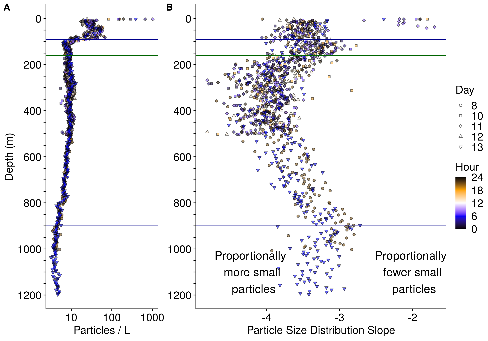
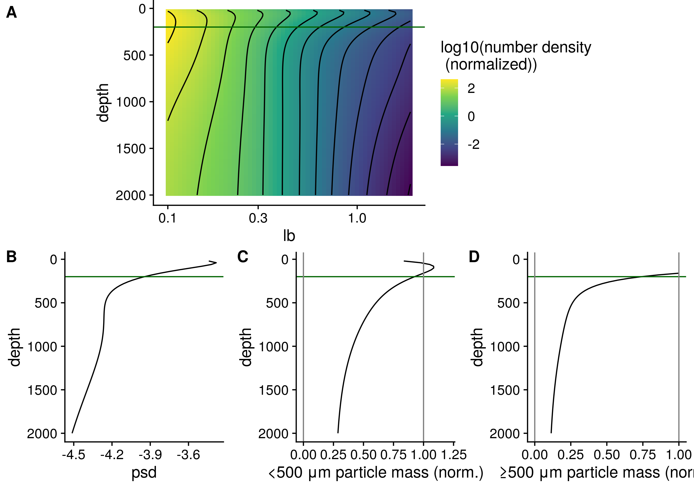

# Author list 
(putative, order not set, please suggest others, will likely expand)
Jacob Cram,
Jessica Pretty,
Megan Duffy,
Rachael L,
Clara Fuchsman,
Klaus H,
Thomas Weber,
Shirley Leung,
Jaqui N,
Allan Duvol,
Rick Keil,
Andrew McDonnel

# Abstract

Models and observations suggest that that particle flux attenuation is lower across the mesopelagic zone of anoxic environments compared to oxic ones. This attenuation is likely a function of microbial metabolism, as well as aggregation and disaggregation by zooplankton and other processes. Analysis of particle size spectra can provide insight into the relative roles of aggregation, disaggregation and remineralization. We measured particle size profiles at one station in the core of the Eastern Tropical North Pacific Oxygen Minimum Zone (ETNP OMZ) using an underwater vision profiler (UVP), at different times of day, over the course of a week. Comparing particle flux measurements from sediment traps allowed us to constrain the particle size to flux relationship, and to generate highly resolved depth and time esttemates of particle flux rates. We found that particle flux attenuated very little throughout the anoxic water column, and at some time-points appeared to increase. Comparason to the predictions models of particle dynamics in OMZs suggested slow remineralization of all sizes of particles, and disaggregation by zooplankton between the base of the photic zone and 500m. Acoustic measurements of multiple size classes of organisms suggested that many orgnisms migrated in the day to this region. Our data suggest a role of zooplankton in transporting biomass in the form of fecal pellets, into the core of the OMZ, but also in disaggregating particles in this same region. We further observe that there is temporal variability in flux transport.

# Introduction

* A
  + The biological pump, in which, sinking particles transport carbon from the surface into the deep ocean, is a key part of the global carbon cycle (Turner 2015; Neuer 2014) [@neuerOceanBiologicalCarbon2014; @turnerZooplanktonFecalPellets2015].
  + Flux into the deep ocean is a function of both export from the photic zone into the mesopelegic (export flux), and the fraction of that flux that crosses the mesopelegic (transfer efficiency) [@passowBiologicalPumpHigh2012; @siegelPredictionExportFate2016]. 
  + Transfer efficiency, the flux between the base of the photic zone and the deep ocean (Francois 2002) [@francoisFactorsControllingFlux2002] is  important in particular, because the depth to which carbon is transported may affect global atmospheric carbon levels (Kwon) [@kwonImpactRemineralizationDepth2009]
  + Zooplankton can affect particle flux in the mesopelegic in several ways (Turner 2015; Steinberg and Landry 2017)[@steinbergZooplanktonOceanCarbon2017; @turnerZooplanktonFecalPellets2015; @jacksonModelDistributionParticle2001], and by extension the efficiency of the biological pump  [@cavanRoleZooplanktonDetermining2017; @archibaldModelingImpactZooplankton2019].
    - (1) Zooplankton repackage particles into fecal pellets which have different properties from the original particles [@wilsonChangesFecalPellet2008].
    - (2) Zooplankton consume particles in surface depths and release it at others, thereby actively transporting carbon, usually downward [@archibaldModelingImpactZooplankton2019; @bianchiIntensificationOpenoceanOxygen2013; @hannidesExportStoichiometryMigrantmediated2009; @steinbergZooplanktonVerticalMigration2000; @stukelNitrogenIsotopeFlows2018; @stukelRolesSuspensionFeedingFluxFeeding2019].
    - (3) Zooplankton consume particles in the mesopelegic and respire some of their biomass  (Stukel et al. 2019).
      + Though it was found that this rate of consumption was less than flux in the California Current [@stukelRolesSuspensionFeedingFluxFeeding2019].
    - (4) Zooplankton  break large particles into smaller ones, likely by generating turbulance when they swim [@dillingFragmentationMarineSnow2000; @goldthwaitEffectsPhysicalFragmentation2005].
      - Fragmentation of particles can lead to increased remineralization of particles because those smaller particle pieces sink more slowly and so have longer residence times, and so have longer to break down in the mesopelegic [@goldthwaitEffectsPhysicalFragmentation2005].
      
  + Oxygen levels, and in particular anoxic regions of the water column, appear to modulate particle flux through the mesopelegic
    - Observations of particle flux in the Easternmost part of the Easten Tropical North Pacific [@vanmooyImpactSuboxiaSinking2002; @hartnettOrganicCarbonInput1998], and Arabian Sea [@keilMultiproxyApproachUnderstanding2016] have suggested lower flux attenuation in these OMZ systems.
    - Models have shown that oxygen limitation in the OMZs is necessary to fit global patterns of particle transfer[@cramRoleParticleSize2018; @devriesExportFateOrganic2017].
    - Oxygen minimum zones in the open ocean are expanding [@strammaExpandingOxygenMinimumZones2008], and this expansion is likely to effect ocean chemistry, the habitat of marine organisms, and the interactions between between organisms and chemistry [@gillyOceanographicBiologicalEffects2013]. Models and chemical data suggest that oxygen minimum zones may enhance carbon transport to the deep ocean, by inhibiting microbial degradation of sinking marine particles [@cramRoleParticleSize2018]. However, biological organic mater transport is modulated by zooplankton [@steinbergBacterialVsZooplankton2008; @steinbergZooplanktonOceanCarbon2017]  which feed on, produce and disaggregate particles, and whose interactions on particle flux in pelagic OMZs are only beginning to be explored [@kikoZooplanktonMediatedFluxesEastern2020].

   + Particle size resolved models of particle transfer through the mesopelegic oceans suggest that temperature, size and oxygen play a big role in modulating particle flux [@cramRoleParticleSize2018; @devriesExportFateOrganic2017].
     - While regional differences in particle ballast plays a smaller role. [@cramRoleParticleSize2018].
     -These models models assume that zooplankton play a small role, and therefore assume no transport through the mesopelegic, and no disaggregation.
     -They therefore predict attenuation of small particles and not large ones.
      + This assumption is questionable, given the established importance of zooplankton.
     - However, these models particle size predictions generate a useful null hypothesis that can be compared against.
           
   + Particle data provide valuable information about particle transport.
     - When performed in concert with traps, they can be used to predict flux in places where traps aren't [@guidiRelationshipParticleSize2008].  They can give resolved information about particle flux variability across space and time [@guidiRelationshipParticleSize2008; @kikoBiologicalPhysicalInfluences2017].
     - They can tell us about the relationship between particle size and sinking speed [@guidiRelationshipParticleSize2008]. (Guidi)
          

   + A recent study combined particle size tracking, mockness tows, acoustic data, and trap measurements from the literature to explore zooplankton transport in a weak OMZ [@kikoZooplanktonMediatedFluxesEastern2020].
     - They found a particle maximum in the mesopelegic and contended that it suggests transport by zooplankton, and mortality of migrating zooplankton.
     - They also suggested that in stronger and larger OMZs there might be less flux into the mesopelegic.
     
  + A recent modeling study posed three hypotheses, each with a prediction about particle size distributions [@weberEfficientParticleTransfer2020]
     * Weber and Bianchi [-@weberEfficientParticleTransfer2020] proposed three reasons that this could occur 
       (1) Slower attenuation of *all* particles: The rate of generalization of all particles could be slower in OMZs.
       (2) Decreased disaggregation by zooplankton: 
       (3) Slower attenuation of large particles: Large particles might harbor cores that are limited in both oxygen and nitrate and so microbial metabolism could be usually slow in these.
        - The authors proposed that these processes would have signature effects on particle size distribution in the core of the ETNP. Slower attenuation of all particles, was predicted to result in an increase in the abundance of small particles, while the other two models, would result in a decrease in small particle abundance as small particles were either not replaced by breakdown of large particles (Model 2) or as those particles were broken down more quickly than larger particles (Model 3). However, they didn't have data to determine which model best fit reality.

* B
  * The data to test each of the three the Weber-Bianchi [-@weberEfficientParticleTransfer2020] models, specifically particle size distributions and corresponding to slope, do not exist for fully anoxic OMZs of the pelegic ocean, to our knowledge.

  * Furthermore, combined measurements of particle numbers, flux and migration of plankton, while avalable in the ETNA (Kiko), have not been made in a fully anoxic region.
    - Indeed this study used trap data from earlier studies. UVP and traps have been sampled together, but not before in an OMZ.
  * While organic mater transport by zooplankton has been hypothesized to be limited in OMZs, this pattern hasn't been tested.
  * It is unknown the degree to which zooplankton swimming or other processes lead to disaggregation.
  + Most OMZ are in the oligotrophic ocean, where productivity is low [@fuchsmanCyanobacteriaCyanophageContributions2019; @penningtonPrimaryProductionEastern2006]. Meanwhile most flux data has been measured in higher productivity regions of the ETNP [@vanmooyImpactSuboxiaSinking2002; @hartnettOrganicCarbonInput1998]. 

* T
  * We targeted a site typical of the oligotrophic ETNP OMZ, well away from the high productivity zone in the coast.
  * We collected particle size data at high temporal resolution over a week
  * We compare it to observed flux measurements, and acoustic data.
  * We describe particle size distribution slope.
  * We quantify, throughout the water column, how changes in size distribution deviate from changes that would be predicted by remineralization and sinking only models.
  * Together, these analyses will provide more detailed information about the relationship between particle transport and zooplankton in the ETNP OMZ.

## Scientific questions:
 * How do the particle size distribution at one location in the oligotrophic Eastern Tropical North Pacific evolve with respect to depth, and how does it vary over time?
 * Do our data support any of the Bianchi-Weber models?
 * Do our data suggest regions of the oxygen minimum zone with disaggregation like processes, and if so do these co-occur with regions suggested to harbor zooplankton.

## We hypothesized
 * Temporal day to day variability in particle number, particles size distribution slope and flux would be evident.
 * This variability would relate to the location of migratory zooplankton, with a combination of increased particle flux and disaggregation present where zooplankton occur.
 * Disaggregation and particle production by zooplankton might lead to particle size patterns that cannot be explained by remineralization and sinking alone.
 Tested whether our data reflected predictions from each of the three Weber-Bianchi models. Specifically we asked wheter our data supported any of the following: slower attenuation of all particles, decreased disaggregation, or slower attenuation of just large particles, in the OMZ core.

 
# Methods
Unless specified otherwise, measurements were taken on board the R/V Sikuliaq from 07 January 2017 through 13 January 2017 at 16.5°N	106.9°W, located in an oligotrophic region of the Eastern Tropical North Pacific Oxygen Minimum Zone (Figure 1A). Data are compared against measurements taken at 16.5°N 152.0°W on 08 May. A same latitude region west of the OMZ, where oxygen is not limiting (Figure S1).

## Water property measurement
We measured water properties of temperature, salinity, fluorescence, oxygen concentration and turbidity using the shipboard XXX CTD {get sensor information}. Data were processed using seabird software and analyzed and visualized in *R*.

## Particle size measurements
Particle size data were collected by Underwater Vision Profiler 5 (UVP) that was mounted below the CTD-rosette and deployed for all CTD casts shallower than 2500 m. A UVP is a combination camera and light source that describes the abundance and size of particles from 100 microns to several centimeters in size [@picheralUnderwaterVisionProfiler2010]. Particles have been previously shown to be primarily "marine snow" but may also include a small number of zooplankton and visual artifacts. UVP data were processed using custom Matlab scripts, uploaded to EcoTaxa, and analyzed in R.

## Flux measurements
Particles were collected in incubating particle traps ({Someone in Ricks' lab -- what is a good reference for these?}). Traps were used to perform incubation studies which will be reported elsewhere. As part of these studies, the traps also generated data about carbon flux, which is reported here. Two types of traps were deployed.  The particles were collected in two kinds of traps. One set of traps, generally deployed in shallower water had a solid cone opening with a cone opening with area 0.46 m^2. The second set had larger conical net with opening of 1.23 m ^2 area made of 200 micron nylon mesh . In all cases particles collected in the net or cone fell into one of two chambers. The "plus-particles" chamber collected particles from the net and incubated them for an amount of time that ranged from X to X days. The top-collector trap collected particles, and then returned immediately to the surface. We preferentially used data from the "top-collector"; however in many cases, data was only available from the "plus-particles" trap, in which case we used that data.

## Analysis
All analyses were constrained to the mesopelegic, defined here as the region between the base of the photic zone and 1000m. 
For many analyses particles were binned by depth with 20 m resolution between the surface and 100m, 25 m resolution between 100m and 200 m depths and 50m resolution between 200m and  1000m. To perform this binning, particle numbers, and volumes of water sampled of each observation in the depth region were summed prior to other analyses.

Two normalized values of particle numbers were calculated. In the first, particle numbers were divided to volume sampled, to generate values in particles/m^3. In the second, particles were divided by both volume sampled and the width of the size bin by which particles were classed to generate values in particles/m^3/mm.

### Particle size distribution

 We determined the slope and intercept of the particle size distribution spectrum by fitting a power law to the data. Because large particles were infrequently detected we used a negative-bionomial-general linear model that considered the volume of particles sampled, and particle bin-size and that assumed that the residuals of the data followed a negative-bionomial (rather than normal) distribution. Thus we fit the equation $log(\frac{E(Total\,Particles)}{Volume *Binsize}) = b_0 + b_1(Size)$ to solve for the Intercept ($b_0$) and particle size distribution slope ($PSD = b_1$). Where the term on the left describes the expected volume and bin-size normalized count data, assuming a negative binomial distribution of residuals.
 
### Estimating particle flux

We estimated particle flux throughout the water column, by fitting particle data to observed trap data. We assumed that particle flux in each size bin (j) followed the equation

$$flux_j =  (\frac{Total\,Particles_j}{Volume * Binsize_i}) * C_f * (Size) ^ a $$ 
(Eqn 1.)

And where flux at a given depth is the sum of all bin specific values.
$$Flux = \sum_j{flux_j}$$ 
(Eqn 2.)

We used the `optimize()` function *R*'s `stats` package to find the values of $C_f$ and $a$ that yielded closest fits of the UVP estimated flux to each particle trap.

Assuming a spherical particle drag profile, it is possible to also derive the exponent of the particle size to biomass exponent $\alpha$  and size to sinking speed exponent $\gamma$ as described in the equations $Biomass_j \sim Size_j^\alpha$ and $Speed_j \sim Size_j^\gamma$ [@guidiRelationshipParticleSize2008], following the equations $a = /alpha + /gamma$ and $\gamma = \alpha -1$.

### Size specific information

We separately analyzed total particle numbers, particle size distribution, and particle flux for particles larger than or equal to 500 microns, and those smaller than 500 microns, to determine the relative contributions of these two particle classes to particle properties.

## Variability
We used a general additive model, of form $Flux ~ s(Depth) + s(Day) + s(Hour)$ to explore whether estimated flux levels appeared to vary by day and hour, holding the effects of depth constant, in the 250 m to 500 m region. The smooth terms $s$ for "Depth" and "Day" were  thin plate splines, while the term for "Hour" was a cyclic spline of 24 hour period.

## Modeling remineralization and sinking
We modified the Particle Remineralization and Sinking (PRiSM) model, as described by DeVries et al. [-@devriesMechanisticParticleFlux2014] to estimate particle size distributions at each depth in the water column from (1) the particle size distribution in the depth bin above, and (2) the estimated change in flux between the two depths (which is itself calculated from the two observed distributions) (Supplement). The model generates a predicted profile at the deeper depth, which can be compared to the shallower depth.

# Results

## Physical and Chemical Data
The anoxic zone, characterized by undetectable oxygen levels, extends from 80 m to 850 m depth, with a sharp upper oxycline and a gradual lower oxycline (Figure 1B-D). The upper oxycline tracks a sharp picnocline (Figure 1C 1D), characterized by a abrupt drop in temperature below the mixed layer, and an increase in salinity (Figure 1B).  The site is characterized two fluorescence maxima (Figure 1C). The larger, shallower fluorescence peak is positioned just above the oxycline, ending exactly where oxygen reaches zero. The smaller, lower peak is positioned entirely inside of the anoxic zone. Turbidity tracks the two chlorophyll peaks in the surface, and has a tertiary maximum at the lower oxycline (Figure 1D).

## Acoustic data reveal diel migration patterns

Acoustic data, produced by the shipboard EK60 , suggest the presence of multiple cohorts of migratory organisms. The largest organisms, observed by backscattering of the EK60's 18000 Hz signal, showed the clearest patterns. Most migratory organisms appeared to leave the surface at dawn and return at dusk, spending the day between 250 and 500m (Figure 2A). There appeared to be two local maxima in backscattering intensity at mid-day, one at ~300m and one at ~375 m (Figure 2A). There also appeared to be organisms that migrated downward at dusk and upward at dawn , spending the night at ~300m (Figure 2B). There was also a peak of organisms that appeared, at mid-day, on some but not all days, without any visible dawn or dusk migration just above the base of the photic zone. (Figure 2C). Other characteristics included what appeared to be diel migrators that crossed the OMZ and spent the day below the range of the EK60 (Figure 2D), as well as organisms that appeared between 500m and 1000m but did not appear to migrate to or from that depth at our site, but rather simply transited through the the EK60's field of view at that time (Figure 2D). 

Similar patterns were evident each other measured frequency, with better resolution by the lower frequencies (Figure S2). 

## Flux data from traps
Flux measurements at station P2 were consistent between the different particle trap types and chambers measured, and showed a profile that broadly represented a power law with respect to depth, with the exception that flux appeared to increase in one trap at 500m. Four traps in the surface had anomalously low measurements of flux, compared to similar traps placed at similar depths, which may have been due to trap malfunctions {Talk to Jaqui about these} (Figure 3).

## Particle abundance measurements vary with size and depth
In all profiles, particle abundances were highest at the surface, and highest among the smallest particles (Figure S3). Visual examination of the relationship between particle number and size suggested a power law relationship where the log of volume and bin-sized normalized particle abundance was proportional to the log of the particles size (Figure S4). The exception to this pattern was very large particles, which are rare enough that they are usually not detected by the UVP. Generalized linear models that assume a negative binomial distribution of the data were able to account for this under-sampling of large particles estimate power log slopes, while taking into account rare occurrences of the data, at each depth (Figure S4). 

Total particle numbers were generally similar between different casts, regardless of which day or hour they were collected (Figure S5A). Particle numbers were highest in the surface and decreased rapidly, flattened out over the 250 m to 500m range, decreased again until the lower oxycline, and then increased below the oxycline (Figure S5A). 

<!-- The slope of the particle size distribution is a negative number with more small particles than large ones with most observations varying between -4.5 and -3 (Figure S_), which is typical of other UVP estimates (Ref Guidi, Cram, Kiko).  -->
The particle size distribution slope steepened (became more negative) between the surface and 500m, flattened (became less negative) between 500m and 1000m, and then steepened again after 1000m (Figure S5B). Steeper, more negative, slopes indicate a higher proportion of small particles relative to large particles, while flatter, less negative, slopes indicate a higher proportion of large particles relative to other places.

<!-- These patterns differed from those seen at the oxic P16-station100, station 100 where particle size distribution was similar to ETNP station P2 through 400m, but where the PSD was then consistently steeper than at P2, and with a local minimum at ~850m and a gradual flattening of the PSD after that. -->

## Estimated particle flux sometimes increases with depth in the OMZ core
Using an optimization algorithm, we found that there was greatest agreement between estimates of trap observed particle flux, and UVP estimated particle flux when the particle size to flux relationship was governed by the ratio $$Flux = 133 * Size ^ {2.00}$$. This resulted in a UVP predicted flux profile that broadly fit the expected trap observed flux profiles, excluding the four traps that were held out from the analysis due to low abundance.  

Particle flux profiles varied notably between casts between the base the photic zone and 100 and 500m m (Figure 4a-b). Between 250 m and 500 m particle flux appeared to increase on some but not all casts, while attenuating slowly on others (Figure 4c). Below 500m, there were not enough casts to measure variability between casts.

General additive models that examined the rate of change of flux between 250 and 500m found that, after removing the effect of depth, there was a statistically significant relationship between day of the week and the fifth-root transformed, rate of change of flux (P = 0.002), as well as between hour of the day and flux (P = 0.040) (Figure S6). There were increases in flux over this region  towards the beginning and end of the sampling period, and lowest near day 10. There was also increases in flux in the daytime but decreases at night-time. By comparing three general additive models, one that considered only depth, one that considered depth and day of the week and on that considered depth, day of week, and time of day, we found that while depth accounted for 37% of the variance, adding day of the week accounted for an additional 18% of the variance, and hour of the day accounted for only 8.7% of the remaining variance in transformed rate of change of flux. If the fifth root transformation was not applied to the rate of change of flux, the hourly pattern was not evident. Increases in flux in this region were clearly not limited to the daytime, as one midnight cast showed increases here as well (Figure 4C).

## ETNP particle dynamics differ from those seen at an oxic site

### Oxic Region: Chemistry
The oxic site was characterized by a more gradually sloping picnocline, and an oxygen minimum at 500m of 19.7 $\mu$M, which is not anoxic (Figure S1B). The photic zone is characterized by a single fluorescence peak with a maximum at 110m and which disappeared at 200m (Figure S1C). Turbidity followed chlorophyll concentration and did not have a peak in the mesopelegic (Figure S1D), unlike the ETNP site. There was a salinity peak at 150m (Figure S1B).

### Anoxic Vs. Oxic Region: Particle Number and Size
Particle numbers were higher, between the base of the photic zone through 1000m at the ETNP site, than at the same-latitude, oxygenic P16 station 100 (Figure S7A). Particle size distributions were similar between the two sites above 500m, being characterized by overlapping confidence intervals by generated by a general additive model. From 500 to 1000m, particle size distributions were  steeper at the ETNP site,being characterized by a higher proportion of small particles (Figure S7B). 

### Anoxic Vs.Oxic Region: Large vs small particles

Small particles (100 $\mu$m - 500 $\mu$m) at the ETNP site were about two orders of magnitude more common than large particles (>= 500 $\mu$m) (Figure S8). Large particle numbers appeared to attenuate more quickly than small particles, and more generally follow a power law decrease, while small particles appeared to increase around 500 m. Flux was predicted to be predominantly from small, rather than large particles, at all depths except the very surface. The particle size distribution, calculated only on large particles, was more variable between depths than calculated for small particles. Data from the oxic P16 station 100 suggested more particles, steeper particle size distribution, and more flux than at this station than at the ETNP station. They also suggested that differences between large and small particles, with respect to number, flux and size distribution that were broadly similar to the ones seen at ETNP Station P2.

### Anoxic vs Oxic Flux

In contrast to the anoxic station, at the oxic station, flux always decreased with depth (Figure S9A+B).

<!-- ## Possible particle transport by zooplankton {move to discussion} -->
<!-- There was an apparent increase in particle flux between XXX and XXX m (Figure X), which corresponded to the region where migratory organisms spent most of the day (Figure X).  -->
<!-- To estimate how this flux increased transfer efficiency, we compared the sequestration flux (flux through the depth bin centered at 975m) to an estimated sequestration flux if a power law, typical of the flux attenuation below 500m, was applied to the flux out of the photic zone (185.5m bin).  -->

<!-- Extrapolating the power law relationship seen below 500m to the flux at the base of the photic zone suggests that if it was not for zooplankton transport the transfer efficiency would be 1/3 of what it is observed to be. -->

<!-- {Compare to P2.} -->

## Smoothed and averaged data
Highly smoothed particle data suggested that particle size, averaged across all casts, followed a pattern in which the abundance of small particles increased in the OMZ surface (Figure 5A), which corresponded with characterized by steepening of the particle size distribution (Figure 5A), an increase in small particle biomass (Figure 5B), but not of large particle biomass (Figure 5C). Deeper in the OMZ the small particle number, PSD slope, and biomass of small particles declined.
At the oxic site, particle size distributions generally steepended with depth, while both small and large particle estemated biomass followed a power law decrease with depth.

## Particle number dynamics differ from model expectations

We were able to use our modified particle remineralization and sinking model to predict particle size distributions at each depth from the particle size distribution at depth one depth-bin shallower and the calculated flux attenuation between the two depths. We found that the observed particle size distributions usually varied from model expectations (Figure S10). Tautologically, at each depth, the observed size profile and the model predicted size profiles have same flux. However, the difference between the flux of observed and predicted *small particles* (100-500), normalized to depth, serves as a valuable metric of patterns of deviations from modeled results. We call this value *OSMS* (**O**bserved **S**mall Flux Minus **M**odeled **S**mall Flux).

$$ OSMS = \frac{(Small\,Flux\,Observed - Small\,Flux\,Modeled)}{\Delta Z}$$             

Eqn. 3

In the above equation $\Delta Z$ is the distance, in meters, between the current depth bin and the previous depth bin, whose particle size distribution is fed into the predictive model.

OSMS was positive between the photic zone and 500m, meaning that less small flux attenuated than would be expected from the PRiSM model in this region. There was some variability in the OSMS parameter between casts. A general additive model, after factoring out the effect of depth, found that there was a statistically significant relationship between day of the cast and OSMS with highest values near day 10 of the study (which is when flux attenuation in this region was lowest) (*p*=0.01) (Figure S11). However there was not a statistically significant relationship between hour of the day and OSMS. 

Below 500m, OSMS was negative. There were only two casts that reached below 500m at this station, and so an analysis of the dynamics of OSMS in this region are not possible.

At P16 Station 100, OSMS was positive between the base of the photic zone and 350m and negative below 350m (Figure S9C).

<!-- We used the difference between predicted flux of small particle and observed flux of small particles to quantify deviations from model expectations. Thus deviations from model are quantified  -->

<!-- in observed and predicted flux by small particles as a single variable to quantify deviation from model expectations.  -->

<!-- We further found that this difference from exceptions varied between depths.  -->

<!-- By comparing the particle size distributions at each depth to the particle size distribution to the distribution that remineralization and sinking model would predict from the flux profile one depth shallower in the water column and observed flux attenuation, we were able to see how observed flux profiles differed from predicted flux profile changes (Figure S_ {generate this for a key depth with both attenuation and disaggregation}). We called the difference between observed and predicted flux of small particles, which is identical, but with opposite sign to the difference between the observed and predicted flux of large particles "Disaggregation Like Flux Shift", because as we will argue in the discussion, disaggregation as well as other processes, would lead to higher values of this Flux-Shift parameter, while aggregation would lead to lower values of the Flux-Shift parameter. We constrain our analysis here to the below photic zone dynamics {for reasons}. There appeared to be highest flux shift between the photic zone and 500m, and negative flux shift below 500m (Figure X). {Say something about P16 once I have identified the location of the photic zone therein.} -->

<!-- be predicted from the particle size distribution one depth bin shallower in the water column, and the observed flux attenuation, we were able to examine how particle number attenuation differed from what would be expected if particles sank and remineralized following PRiSM model like dynamics. We observed that there were more small particles than would be predicted from remineralization dynamics only. By comparing the observed flux of particles < 53 microns to the reminineralization-predicted flux of small particles, we observed that above 500m, there was excess observed small particle flux above 500m (Figure X).  -->

# Discussion

## Diel migrators spend time in the OMZ core
Organisms of all sizes appear to migrate into the core of the OMZ at our site. Most migrators appear to leave the surface at dusk, spend the day in the top 500m of the OMZ in the day and return to the surface at dusk (Figure 2A), while others show the opposite pattern, leaving the surface at dusk and returning at dawn (Figure 2B). Diel migration is prevalent throughout the oceans [@haysReviewAdaptiveSignificance2003; @cisewskiSeasonalVariationDiel2010; @heywoodDielVerticalMigration1996; @jiangTemporalVariabilityZooplankton2007; @rabindranathSeasonalDielVertical2011; @yangDielVerticalMigration2019; @sainmontInterIntraspecificDiurnal2014], including other OMZ sites [@antezanaSpeciesspecificPatternsDiel2009; @kikoZooplanktonMediatedFluxesEastern2020] (+ Riqulme-Bugueno 2020), including highly anoxic sites with secondary, anoxic deep chlorophyl maxima like this one [@hidalgoOntogeneticVerticalDistribution2005], and much of the ETNP OMZ [@herreraVerticalVariabilityEuphausia2019]. Sampling efforts elsewhere in the ETNP suggested that any of of these diel migrators are euphausids and fish [@maasFinescaleVerticalDistribution2014] (+Wishner 2013), and that diel migrators are primarely 2-5 mm in size (Wishner et al. 2013). Krill have been shown to have the opposite pattern in the Humboldt current OMZ, migrating to the surface at night time, as seen for some organisms at our site (Figure 1B) (Riqulme-Bugueno 2020). The presence of organisms that appear and disapear just above the base of the photic zone, in the region of the deeper anoxic fluorescence peak region, but abscence of a tell-tale signature of mass migration before or after they appear (Figure 1C) may suggest that these organisms migrate at different times of the day to this deep region, rather than all at once. Another possiblility is that they are transiting through our station at this depth in mid day, but do not migrate to depth at this location, but rather at another location.

The organisms that appear between 500m and 1000 m (Figure 2E) have acoustic signatures that resemble jellyfish [@kaartvedtDielVerticalMigration2007]. That they appear in horizontal bands that do not appear to trend upwards over time suggests that they are traveling through our site at progressively shallower depths over the course of the day, but that individual swarms are not themselves moving upward at this station. This suggests that any vertical migration carried out by these organisms happens elsewhere, or occurs more slowly than the advection seen at this site. That they appear at different depths at different times of the day suggest that these organsims have some sort of vertical migration pattern. Future work may consider more highly resolved spatial and temporal monitoring of this phenominan. Indeed molecular surveys have found evidence of both Cnidarians and Ctenophores both within and below the the ETSP OMZ near Chile (Parris et al 2014).

<!-- At the size range seen by the 18000 kHz band, Humboldt and market squid are known to be tolerant to anoxia and to migrate into the OMZ to hunt. These small organisms likely have the greatest effect on particle transport (ref) and disaggregation (ref). Diel migration patterns are common in the ocean (ref) and zooplankton transport of particles have been indicated in other environments (ref).  -->

## Flux is lower at this site than previous measurements in the ETNP 
{Unless Megan Duffy is going to have already said this somewhere}.

Flux here is lower at all depths than seen in previous measurements by traps in the OMZ [@vanmooyImpactSuboxiaSinking2002; @hartnettOrganicCarbonInput1998]. This difference is expected, because the previous measurements were taken nearer to the coast, where surface chlorophyll is higher than at our site. 

## The flux to size relationship is typical of other sites.

The exponent of the particle size to flux relationship  that we saw at our site 2.00, is of a similar magnitude to those seen by other studies that compare UVP flux to traps [@guidiRelationshipParticleSize2008; @kikoZooplanktonMediatedFluxesEastern2020] (Guidi, Kiko). It is not identical to these measurements. This could be because these values vary between sites, or that imprecision in flux measurements leads to differences in these values between studies. Indeed, we found this value was sensitive to outlying data points.

If we used in the four traps that measured very little flux in the surface in our fitting algorithm, we instead got values for this size relationship exponent that approached zero. Because we have found that traps appear to under-measure flux when they fail, rather than over measure it, we have gone with the higher measurements. {People in Rick's lab -- any other thoughts about these low measurments?}

## Remineralization rates of all particles decrease in the OMZ, but disaggregation does not
Particle size profiles, particle size distribution slopes, and estimated biovolume, averaged across all casts and smoothed, are all similar to the predictions made by Weber and Bianchi's [-@weberEfficientParticleTransfer2020] "Model 1". (Figure 4). This suggests that the low oxygen at this site decreases the particle remineralization rate of all particles, including small ones. It does not support the Weber-Bianchi Model 2 in which remineralization is suppressed in the OMZ, nor their model 3 in which only the very large particles' remineralization is slowed. The data at the oxic site, generally conformed to Weber and Bianchi's "Model 0" [-@weberEfficientParticleTransfer2020], which was their prediciton for particle distributions at oxic sites. However, one difference was that the particle size distribution, while essentially constant from the base of the photic zone through 1000m, appeared to steepen between 1000 and 2000m, suggesting an increase in the abundance of small particles. This could indicate increased disaggregation in this region or horizontal transport of small particles through advection in this region.

## Zooplankton likely transport organic mater into the OMZ core.
Predicted flux levels sometimes increase between 275 and 625 meters, and at all time attenuate very slowly in this region. The EK60 data suggest diel migration of organisms of all sizes to this same region. Taken together, this increase in flux concurrent diel migration, suggest transport of organic mater by zooplankton. That the flux varies between days suggests some day to day variability in this transport. That it is highest in the day, on average, suggests that the diel migrators may be contributing to this flux, but the fact that this diel variability is small compared to overall variability suggests that other processes may modulate this rate, and that nocturnal migrators may also play a role in carbon transport.

## Zooplankton likely disaggregate particles in the OMZ core.

The observation that there is greater flux by small particles (< 500 $\mu m$) than would be predicted by remineralization and sinking alone (Figure 9), between the photic zone and 500m suggests that some process is disaggregating large particles into smaller ones. That this corresponds with the region where migratory organisms are found suggests that some of these organisms, likely small plankton such as copepods and euphausids [@herreraVerticalVariabilityEuphausia2019; @maasFinescaleVerticalDistribution2014], may be breaking down particles  [@goldthwaitEffectsPhysicalFragmentation2005; @dillingFragmentationMarineSnow2000]. Alternatively, other processes such as horizontal advection of water containing small particles could be responsible for this increase in small particles (Inthorn 2005).

Other deviations from model assumptions could also explain the increase in small particles over model predictions For instance, if the models assumed relationship between size, flux, sinking speed and biomass are not all accurate, particle dynamics would also differ. For instance, if remineralization differed between particle types, with small particles breaking down more slowly than larger ones, perhaps because they are more labile, we might see the same kind of deviation from the model. If small particles sank more quickly for their size than expected, as has been seen elsewhere [@mcdonnellVariabilityAverageSinking2010], a similar deviation would occur as they would have less time to remineralize per depth.

Our model also assumes a spherical particle drag profile, such that the particle sinking speed fractal dimension ($gamma$) is one less than the particle size fractal dimension ($alpha$) [@cramRoleParticleSize2018; @guidiRelationshipParticleSize2008], and that these two values sum to the particle flux fractal dimension. If any of these assumptions do not hold, or even if our calculation of the particle flux fractal dimension was in error, the magnitude of the values may differ.

Furthermore, since flux varies over time, that variability could contribute to our observed patterns. We have not deconvoluted temproral variability from model effects these processes, but future models could leverage time series data like this one to incorporate multiple observed time-points into the prediction of particle size distributions at depth. One way to do this would be to use a smoothing function to interpolate particle abundances at each size, depth and times, and then to use a model in which the sinking speed of a given particle size is used to identify the relevant time-point where the abundance informs that time-point.

The opposite pattern to that seen at shallower depths occurs below 500m, with apparent flattening of the particle size distribution. This could suggest aggregation occurs here. Given the sparsity of particles however, aggregation seems improbable, since particles are unlikely to collide when they are sparse [@devriesMechanisticParticleFlux2014]. One possibility is that the abundant small particles produced in the top 500m are the things that are aggregating. It is also possible that particles do only remineralize and sink, but one of our parameters, such as the fractal dimension of particle sinking or particle biomass that we use does not reflect reality.

## Revisiting Hypotheses {This may be too redundant with other stuff}

Our data provide the first combined look at the relationship between particle size, particle flux and migratory organisms. Our data support only the first of the Weber-Bianchi hypotheses [@weberEfficientParticleTransfer2020], that particles of all sizes remineralize more slowly in OMZs. It did not support Weber and Bianchis hypotheses that disaggregation is lower in the OMZ, nor that the largist particles degraded particularly slowly in OMZs. This non-support of the final hypotheses, that large particles do not degrade particularly slowly, is suprising because, models suggest that remineralization in the largest particles is driven by sulfate reduction, which is not as efficient as other processes [@weberEfficientParticleTransfer2020].

While we hypothesized temporal within and between day variability in particle size, number and flux, we only observed statistically significant temporal variability in flux, and this variability was relatively small, compared to the total amount of flux. Flux was, in general, highest in the day-time, suggesting transport by diel migrators, but this variabiliy was not very strong. This suggests, that particle sinking speed may be slow enough that the diel migratory patterns of zooplankton occur on a shorter time-scale than that at which particles sink out of different water column layers. Careful analysis of particle sinking speed estemates would help to zero in on these time scales, but is beyond the scope of the current manuscript. 

Our data supported our hypothsis particle size patterns cannot be explained by remineralization and sinking alone. Indeed the abundance of small particles above 500m, suggested either the presence of disaggreagation, or another process.

## Caveats

* The disaggregation model leaks. We dealt with this by optimizing the remineralization paramter. 
* We don't see particles smaller than some size, and undersample large particles. Large particles could in fact, as Weber and Bianchi suggest, break down slowly, but we may not have detected such patterns due to undersampling.
* Our disaggregation model makes many assumptions. We contend that disaggregation is a likely scenario, but not the only one.
* Currents may play a role in transporting particles into our envonrments horizontally -- it is generally thougt that advection can be ignored in environments like this one where flus is faster than the rate at which water advects in from different environments. However if some particles are neutrally bouyant or otherwise very slowly sinking, it may be relevant to look at how particles may be moving horizontally.

## Opportunites for future directions
* Our model can estemate the remineralization paramters. It may be possible to identify the effect of oxygen and temparature on remineralization from size profiles and compare these parameters to estemates by Cram et al.

* Explore whether Weber-Bianchi model 1 holds in other OMZ environments.

* Since temporal variability only has a smallish role in stuff, it may be reasonable to explore disaggregation like processes without the time-series in other environements, such as globally.

* More explicitly consider temporal variability in sinking speed and currents.

# Conclusions

We suggest that while particles appear to remineralize more slowly at this site, and that this is true of all sizes of particles not just large ones. Furthermore, it appears that diel migratory organisms both disaggregate particles and transport carbon throughout the top 500m of the water column. Day to day and within day variability in organic mater transport was evient, though overall patterns in particle size, flux and disaggregation appeared to be consistant over the course of the time-series.

##

# Figures

Figure 1. Overview of the geography, physics and chemistry of ETNP station P2 **(A)** Map of the ETNP Oxygen Minimum Zone and the location of station P2. Colors indicate chlorophyll concentrations at the surface, while the red outline signifies the region containing low oxygen. The red circle indicates the location of Station P2. (B-D) Oceanographic parameters collected from a cast at 2017-01-13 12:15 CST (local time). All profiles contain a plot of oxygen concentrations. When available, the thin horizontal green line shows the location of the base of the photic zone (160m), while the horizontal blue line shows the base of the oxycline. Figures B and D also show density (Dashed Gray Line). (B) highlights temperature and salinity. (C) fluorescence, focusing on the top 300m of the water column, and (D) beam attenuation.

Figure 2. Acoustic data, measured by EK60, measured over the course of the experiment. Shown are data from the 18000 Hz frequency band, which have highest depth penetration, but which appear to co-occur with data from other frequency bands (see Figure SX). Values are in return signal intensity and have not been normalized to observed biomass. Several interesting patterns can be seen. **A.** Two bands of organisms can be seen leaving the surface at dawn, spending the day between 250 and 500m and returning to the surface at dusk. **B.** Another group of nocturnally migrating organisms can be seen leaving the surface at dusk, spending the night near 250m and returning at dawn. **C.** Some organisms appear at the base of the photic zone, during some, but not all mid days, and then disappear in the evening. **D.** A group of very deep migrating organisms appears to leave the surface with the diel migrators and pass all the way through the OMZ and out of the EK60's field of view. It returns at dusk. **E.** Swarms of organisms appear between 500 and 1000m disappearing later in the day. Swarms appear in the deepest layers at night and appear progressively shallower as the day progresses.

Figure 3. Particle flux, measured from sinking traps large symbols. Data from the "plus particles" and "top collector" samples from both cone and net traps were collated to generate these data. Trap types are shown by the shape and color of the large points. Superimposed are binned estimates of particle flux generated by fitting the sum of particle numbers all four profiles, binned as in Figure X, to the trap observed flux. The four points enclosed by the rectangle are unusually low compared to other traps collected at the same depth, and were therefore excluded from the fit. {Convert UVP points to a line, maybe leave points where the traps ares}

Figure 4.  Within and between day variability in UVP predicted particle flux at ETNP station P2. Profiles are compared against P16 station 100, a non OMZ station at similar latitude in the tropical pacific. All profiles are depth binned with higher resolution towards the surface (methods).  **(A)** Flux profiles in the top 1000m of the water column. **(B)** A more detailed depiction of the area enclosed by the rectangle in **A**. **(C)** The rate of change of flux, divided by the rate in change in depth. We show the fifth root of these values in order to highlight differences between values close to zero.

Figure 5. **(A)** GAM smoothed bin-size and volume particle numbers at each particle size class. **(B)** Particle size distributions. And estimated biomass of **(C)** Small and **(D)** Large particles. 

Figure 9. Quantification of non remineralization and sinking like processes. Points indicate the difference between the observed small particle flux, and the flux that would be estimated if particles from the size distribution in the depth bin above remineralized and sank only following the PRiSM model. Values are normalized to the change in depth. Thus values are $\mu$mol Carbon/m3/day {change to "Deviation from Model", keep units}

# Supplemental Figs
[move to supplement]

Figure S1. Physical and chemical data from P16 Station 100. Located at 16.5°N 152.0°W. (A) Map of the nearby tropical pacific station P6 Station 100. Colors indicate chlorophyll concentrations at the surface, averaged over all MODIS images. The red circle indicates the location of Station P2. (B-D) Oceanographic parameters. The thin horizontal green line shows the location of the base of the photic zone (200m m). **A** Oxygen, and fluorescence. Because the fluorometer was broken on this cruise, fluorescence data were pulled from world ocean atlas. **B** Oxygen temperature and salinity. **(C)** Beam attenuation and density, calculated from the salinity temperature and pressure data.

Figure S2. Acoustic data, measured by EK60, measured over the course of the experiment. Shown are data from the all frequency bands. Values are in return signal intensity and have not been normalized to observed biomass.

Figure S3. A profile of particle abundances at different sizes and depths. **(A)** Numbers of observed particles and **(B)** particle numbers normalized to volume sampled and particle size bin width. **(C)** Smoothed and extrapolated particle abundances, based on a negative binomial GAM that predicts particle abundance form size and depth.

Figure S4. An example of observed particle size distribution spectra. These are depth binned data from between X and X m deep in the water column from the cast that occurred at *DATETIME for stn_043*. A total volume of XXX L of water are sampled herein. Points indicate **(A)** total numbers of observed particles and **(B)** particle numbers normalized to volume sampled and particle size bin width. The line indicates the predicted best fit line of the data. The line was fit on the bin and volume normalized data by a negative-binomial general linear model. The line in panel **A** indicates predictions from this same model, re-scaled into absolute particle space.

Figure S5. (A) Observed, volume normalized total particle numbers from 9 casts taken at different times of the day at ETNP station P2. (B) Calculated particle size distribution slopes of those particles. These data have not been binned by depth. {Axes are backward}

Figure S6. GAM predicted effects of **A** Depth, **B** Day of the month in January 2017, and **C** hour of the day on the fifth-root transformed, depth normalized, rate of change of flux. Y axis indicates the value of the component smooth functions effect on Flux. Positive values associate with times and regions of the water column where flux is increasing, holding other factors constant, and negative ones where it is decreasing.

 Figure S7. As above, but for the final cast taken at ETNP station P2 and the only cast collected from the P16 transect at the station 100. P16 Station 100 was chosen because it is at a similar latitude to ETNP station P2. (A) Total particle numbers, (B) Particle size distribution. **{Cut to 1000m}**
 
 
Figure S8. Depth binned particle number (volume normalized), particle size slope (PSD), and flux (estimated as in Fig. 4) for large ($>= 500\, \mu m$), small ($< 500 \, \mu m$) and total particles, at the oxic and anoxic site
 

Figure S9. Flux profiles and flux attenuation at P2 Station 100. **(A)** Flux profile **(B)** Fifth-root transformed depth normalized rate of flux decrease. **(C)** Difference between observed and modeled results. Higher values suggest more disaggregation-like processes.

Figure S10. The same profiles as shown in Figure 5, but for the oxic site P16 Station 100. **(A)** GAM smoothed bin-size and volume particle numbers at each particle size class. **(B)** Particle size distributions. And estimated biomass of **(C)** Small and **(D)** Large particles. 

Figure S11. An example of differences between modeled and observed particle slope. Shown are profiles of particles between 100 $\mu m$ and 500 $\mu m$ than 1 mm. The particle size distribution at a shallow and deeper depth are shown. The model generates a prediction of the deep depth profile form the shallow depth profile and the flux attenuation between the two profiles. The model predicts more attenuation of the smallest particles than it actually observed. 

Figure S12. GAM predicted effects of **A** Depth, **B** Day of the month in January 2017 Y axis indicates the value of the component smooth functions effect on the difference between observed and modeled flux. Thus higher values correspond with greater flux of small particles than predicted by the model.

## Talk about

Different community vs oxic things.

Wishner -- there is a peak of biomass at lower OMZ -- lower oxycline

Directions -- 
Progression -- models and can actually test hypotheses for proposal

# References

